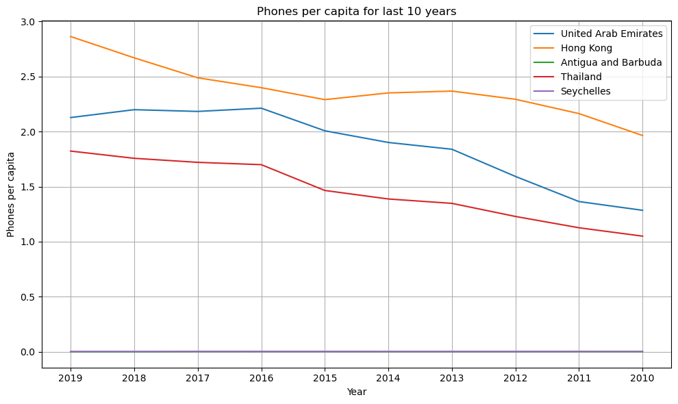

# Cleaning data


```python
import pandas as pd
import numpy as np

pd.set_option('display.max_rows', 215)
pd.set_option('display.max_columns', 215)
data = pd.read_csv("cell_phones_total.csv")

data.head()
```


<div>
<style scoped>
    .dataframe tbody tr th:only-of-type {
        vertical-align: middle;
    }

    .dataframe tbody tr th {
        vertical-align: top;
    }

    .dataframe thead th {
        text-align: right;
    }
</style>
<table border="1" class="dataframe">
  <thead>
    <tr style="text-align: right;">
      <th></th>
      <th>iso-3</th>
      <th>1960</th>
      <th>1965</th>
      <th>1966</th>
      <th>1967</th>
      <th>1968</th>
      <th>1969</th>
      <th>1970</th>
      <th>1971</th>
      <th>1972</th>
      <th>1973</th>
      <th>1974</th>
      <th>1975</th>
      <th>1976</th>
      <th>1977</th>
      <th>1978</th>
      <th>1979</th>
      <th>1980</th>
      <th>1981</th>
      <th>1982</th>
      <th>1983</th>
      <th>1984</th>
      <th>1985</th>
      <th>1986</th>
      <th>1987</th>
      <th>1988</th>
      <th>1989</th>
      <th>1990</th>
      <th>1991</th>
      <th>1992</th>
      <th>1993</th>
      <th>1994</th>
      <th>1995</th>
      <th>1996</th>
      <th>1997</th>
      <th>1998</th>
      <th>1999</th>
      <th>2000</th>
      <th>2001</th>
      <th>2002</th>
      <th>2003</th>
      <th>2004</th>
      <th>2005</th>
      <th>2006</th>
      <th>2007</th>
      <th>2008</th>
      <th>2009</th>
      <th>2010</th>
      <th>2011</th>
      <th>2012</th>
      <th>2013</th>
      <th>2014</th>
      <th>2015</th>
      <th>2016</th>
      <th>2017</th>
      <th>2018</th>
      <th>2019</th>
    </tr>
  </thead>
  <tbody>
    <tr>
      <th>0</th>
      <td>ABW</td>
      <td>0.0</td>
      <td>0.0</td>
      <td>NaN</td>
      <td>NaN</td>
      <td>NaN</td>
      <td>NaN</td>
      <td>0.0</td>
      <td>NaN</td>
      <td>NaN</td>
      <td>NaN</td>
      <td>NaN</td>
      <td>0.0</td>
      <td>0.0</td>
      <td>0.0</td>
      <td>0.0</td>
      <td>0.0</td>
      <td>0</td>
      <td>0</td>
      <td>0</td>
      <td>0</td>
      <td>0</td>
      <td>0</td>
      <td>0</td>
      <td>0</td>
      <td>0</td>
      <td>0</td>
      <td>0</td>
      <td>0</td>
      <td>20</td>
      <td>NaN</td>
      <td>NaN</td>
      <td>1720</td>
      <td>3000</td>
      <td>3400</td>
      <td>5380</td>
      <td>12k</td>
      <td>15k</td>
      <td>53k</td>
      <td>61.8k</td>
      <td>70k</td>
      <td>98.4k</td>
      <td>103k</td>
      <td>109k</td>
      <td>114k</td>
      <td>121k</td>
      <td>128k</td>
      <td>132k</td>
      <td>NaN</td>
      <td>135k</td>
      <td>139k</td>
      <td>140k</td>
      <td>141k</td>
      <td>NaN</td>
      <td>NaN</td>
      <td>NaN</td>
      <td>NaN</td>
    </tr>
    <tr>
      <th>1</th>
      <td>AFG</td>
      <td>0.0</td>
      <td>0.0</td>
      <td>NaN</td>
      <td>NaN</td>
      <td>NaN</td>
      <td>NaN</td>
      <td>0.0</td>
      <td>NaN</td>
      <td>NaN</td>
      <td>NaN</td>
      <td>NaN</td>
      <td>0.0</td>
      <td>0.0</td>
      <td>0.0</td>
      <td>0.0</td>
      <td>0.0</td>
      <td>0</td>
      <td>0</td>
      <td>0</td>
      <td>0</td>
      <td>0</td>
      <td>0</td>
      <td>0</td>
      <td>0</td>
      <td>0</td>
      <td>0</td>
      <td>0</td>
      <td>0</td>
      <td>0</td>
      <td>0</td>
      <td>0</td>
      <td>0</td>
      <td>0</td>
      <td>0</td>
      <td>0</td>
      <td>0</td>
      <td>0</td>
      <td>0</td>
      <td>25k</td>
      <td>200k</td>
      <td>600k</td>
      <td>1.2M</td>
      <td>2.52M</td>
      <td>4.67M</td>
      <td>7.9M</td>
      <td>10.5M</td>
      <td>10.2M</td>
      <td>13.8M</td>
      <td>15.3M</td>
      <td>16.8M</td>
      <td>18.4M</td>
      <td>19.7M</td>
      <td>21.6M</td>
      <td>23.9M</td>
      <td>22M</td>
      <td>22.6M</td>
    </tr>
    <tr>
      <th>2</th>
      <td>AGO</td>
      <td>0.0</td>
      <td>0.0</td>
      <td>NaN</td>
      <td>NaN</td>
      <td>NaN</td>
      <td>NaN</td>
      <td>0.0</td>
      <td>NaN</td>
      <td>NaN</td>
      <td>NaN</td>
      <td>NaN</td>
      <td>0.0</td>
      <td>0.0</td>
      <td>0.0</td>
      <td>0.0</td>
      <td>0.0</td>
      <td>0</td>
      <td>0</td>
      <td>0</td>
      <td>0</td>
      <td>0</td>
      <td>0</td>
      <td>0</td>
      <td>0</td>
      <td>0</td>
      <td>0</td>
      <td>0</td>
      <td>0</td>
      <td>0</td>
      <td>1100</td>
      <td>1820</td>
      <td>1990</td>
      <td>3300</td>
      <td>7050</td>
      <td>9820</td>
      <td>24k</td>
      <td>25.8k</td>
      <td>75k</td>
      <td>140k</td>
      <td>350k</td>
      <td>740k</td>
      <td>1.61M</td>
      <td>3.05M</td>
      <td>4.96M</td>
      <td>6.77M</td>
      <td>8.11M</td>
      <td>9.4M</td>
      <td>12.1M</td>
      <td>12.8M</td>
      <td>13.3M</td>
      <td>14.1M</td>
      <td>13.9M</td>
      <td>13M</td>
      <td>13.3M</td>
      <td>13.3M</td>
      <td>14.8M</td>
    </tr>
    <tr>
      <th>3</th>
      <td>ALB</td>
      <td>0.0</td>
      <td>0.0</td>
      <td>NaN</td>
      <td>NaN</td>
      <td>NaN</td>
      <td>NaN</td>
      <td>0.0</td>
      <td>NaN</td>
      <td>NaN</td>
      <td>NaN</td>
      <td>NaN</td>
      <td>0.0</td>
      <td>0.0</td>
      <td>0.0</td>
      <td>0.0</td>
      <td>0.0</td>
      <td>0</td>
      <td>0</td>
      <td>0</td>
      <td>0</td>
      <td>0</td>
      <td>0</td>
      <td>0</td>
      <td>0</td>
      <td>0</td>
      <td>0</td>
      <td>0</td>
      <td>0</td>
      <td>0</td>
      <td>0</td>
      <td>0</td>
      <td>0</td>
      <td>2300</td>
      <td>3300</td>
      <td>5600</td>
      <td>11k</td>
      <td>29.8k</td>
      <td>393k</td>
      <td>851k</td>
      <td>1.1M</td>
      <td>1.26M</td>
      <td>1.53M</td>
      <td>1.91M</td>
      <td>2.32M</td>
      <td>1.86M</td>
      <td>2.46M</td>
      <td>2.69M</td>
      <td>3.1M</td>
      <td>3.5M</td>
      <td>3.69M</td>
      <td>3.36M</td>
      <td>3.4M</td>
      <td>3.37M</td>
      <td>3.63M</td>
      <td>2.71M</td>
      <td>2.63M</td>
    </tr>
    <tr>
      <th>4</th>
      <td>AND</td>
      <td>0.0</td>
      <td>0.0</td>
      <td>NaN</td>
      <td>NaN</td>
      <td>NaN</td>
      <td>NaN</td>
      <td>0.0</td>
      <td>NaN</td>
      <td>NaN</td>
      <td>NaN</td>
      <td>NaN</td>
      <td>0.0</td>
      <td>0.0</td>
      <td>0.0</td>
      <td>0.0</td>
      <td>0.0</td>
      <td>0</td>
      <td>0</td>
      <td>0</td>
      <td>0</td>
      <td>0</td>
      <td>0</td>
      <td>0</td>
      <td>0</td>
      <td>0</td>
      <td>0</td>
      <td>0</td>
      <td>0</td>
      <td>770</td>
      <td>780</td>
      <td>784</td>
      <td>2830</td>
      <td>5490</td>
      <td>8620</td>
      <td>14.1k</td>
      <td>20.6k</td>
      <td>23.5k</td>
      <td>29.4k</td>
      <td>32.8k</td>
      <td>51.9k</td>
      <td>58.4k</td>
      <td>64.6k</td>
      <td>69k</td>
      <td>63.5k</td>
      <td>64.2k</td>
      <td>64.5k</td>
      <td>65.5k</td>
      <td>65k</td>
      <td>63.9k</td>
      <td>63.9k</td>
      <td>66.2k</td>
      <td>71.3k</td>
      <td>76.1k</td>
      <td>80.3k</td>
      <td>82.6k</td>
      <td>87.9k</td>
    </tr>
  </tbody>
</table>
</div>


```python
print("The data has ", data.isnull().sum().sum(), "missing values" )
```

    The data has  2410 missing values
    

By using **data.dtypes** we can see that some columns in our dataframe is of type float and some of them is of type object. We will write a function that will handle both of those cases and transform all of them into float (just in case). For this purpose we will write different conditions for our functions that can handle different situations. The values in cells can be floats, integers, missing, strings. The indexes k,M,B will be replaced by appropriate numbers. After


```python
#function that converts string values to numeric
def convert_to_numeric(value):
    if pd.isna(value) or isinstance(value, (int, float)):
        return value
    elif value == '' or value == '0':
        return float(0)  # fill strings zeros with actual zeros
    multiplier = 1
    if 'K' in value:
        multiplier = 1e3
    elif 'M' in value:
        multiplier = 1e6
    elif 'B' in value:
        multiplier = 1e9
    return float(value[:-1]) * multiplier

columns_to_convert = data.loc[:, '1960':'2019'].columns
data[columns_to_convert] = data[columns_to_convert].applymap(convert_to_numeric)

```

Now we can see that every element in columns 1960-2019 is indeed a number. Now we have cleaned our data and may proceed 
with working with it. Now how will we deal with the missing values? 

Well first we need to know that there is severeal different types of missing data:
Types of missing values:
* Missing Completely At Random (MCAR)

the probability of data being missing is the same for all the observations


* Missing At Random (MAR)

MAR data means that the reason for missing values can be explained by variables on which you have complete information, as there is some relationship between the missing data and other values/data. In this case, the data is not missing for all the observations. It is missing only within sub-samples of the data, and there is some pattern in the missing values.


* Missing Not At Random (MNAR)


We should also use logic to why the data may be missing. The most values that are missing or equal to zero is between **1960-1990**. This is not so strange since cellphones were not widely available during that period so replacing missing values with zeros reflects the assumption that there were no cellphones at that time. And since many cells in those years had value 0 it makes sense to set other values to zero as well. 

For they years after **1990** dropping values is probably not the best choice because there is much other valuable inforamtion in that row/column. Thats why i decided to replace the missing valeus with zeros. After that lets double check that the data doesnt have any null values left.


```python
data = data.fillna(0)
```


```python
print("The data has ", data.isnull().sum().sum(), "missing values" )
```

    The data has  0 missing values
    


```python
answer1 = data.loc[:, "2015":"2019"]

answer1.head()
```


<div>
<style scoped>
    .dataframe tbody tr th:only-of-type {
        vertical-align: middle;
    }

    .dataframe tbody tr th {
        vertical-align: top;
    }

    .dataframe thead th {
        text-align: right;
    }
</style>
<table border="1" class="dataframe">
  <thead>
    <tr style="text-align: right;">
      <th></th>
      <th>2015</th>
      <th>2016</th>
      <th>2017</th>
      <th>2018</th>
      <th>2019</th>
    </tr>
  </thead>
  <tbody>
    <tr>
      <th>0</th>
      <td>141.0</td>
      <td>0.0</td>
      <td>0.0</td>
      <td>0.0</td>
      <td>0.0</td>
    </tr>
    <tr>
      <th>1</th>
      <td>19700000.0</td>
      <td>21600000.0</td>
      <td>23900000.0</td>
      <td>22000000.0</td>
      <td>22600000.0</td>
    </tr>
    <tr>
      <th>2</th>
      <td>13900000.0</td>
      <td>13000000.0</td>
      <td>13300000.0</td>
      <td>13300000.0</td>
      <td>14800000.0</td>
    </tr>
    <tr>
      <th>3</th>
      <td>3400000.0</td>
      <td>3370000.0</td>
      <td>3630000.0</td>
      <td>2710000.0</td>
      <td>2630000.0</td>
    </tr>
    <tr>
      <th>4</th>
      <td>71.3</td>
      <td>76.1</td>
      <td>80.3</td>
      <td>82.6</td>
      <td>87.9</td>
    </tr>
  </tbody>
</table>
</div>


# Combining Data

Now that we have cleaned our cell phones data, we want to analyse the number of cell phones per capita. To make this possible, we need to expand our original dataset. The file **pop_data.csv** contains data about the population size of countries over years. Once again there will be missing values. To combine the cell phone data with the population data, we need to reshape both datasets. This can be done by pivotting the tables into the right format.


```python

popdata = pd.read_csv("pop_data.csv")
popdata.head()
```


<div>
<style scoped>
    .dataframe tbody tr th:only-of-type {
        vertical-align: middle;
    }

    .dataframe tbody tr th {
        vertical-align: top;
    }

    .dataframe thead th {
        text-align: right;
    }
</style>
<table border="1" class="dataframe">
  <thead>
    <tr style="text-align: right;">
      <th></th>
      <th>Unnamed: 0</th>
      <th>iso-3</th>
      <th>1960</th>
      <th>1961</th>
      <th>1962</th>
      <th>1963</th>
      <th>1964</th>
      <th>1965</th>
      <th>1966</th>
      <th>1967</th>
      <th>1968</th>
      <th>1969</th>
      <th>1970</th>
      <th>1971</th>
      <th>1972</th>
      <th>1973</th>
      <th>1974</th>
      <th>1975</th>
      <th>1976</th>
      <th>1977</th>
      <th>1978</th>
      <th>1979</th>
      <th>1980</th>
      <th>1981</th>
      <th>1982</th>
      <th>1983</th>
      <th>1984</th>
      <th>1985</th>
      <th>1986</th>
      <th>1987</th>
      <th>1988</th>
      <th>1989</th>
      <th>1990</th>
      <th>1991</th>
      <th>1992</th>
      <th>1993</th>
      <th>1994</th>
      <th>1995</th>
      <th>1996</th>
      <th>1997</th>
      <th>1998</th>
      <th>1999</th>
      <th>2000</th>
      <th>2001</th>
      <th>2002</th>
      <th>2003</th>
      <th>2004</th>
      <th>2005</th>
      <th>2006</th>
      <th>2007</th>
      <th>2008</th>
      <th>2009</th>
      <th>2010</th>
      <th>2011</th>
      <th>2012</th>
      <th>2013</th>
      <th>2014</th>
      <th>2015</th>
      <th>2016</th>
      <th>2017</th>
      <th>2018</th>
      <th>2019</th>
      <th>2020</th>
    </tr>
  </thead>
  <tbody>
    <tr>
      <th>0</th>
      <td>0</td>
      <td>ABW</td>
      <td>54608.0</td>
      <td>55811.0</td>
      <td>56682.0</td>
      <td>57475.0</td>
      <td>58178.0</td>
      <td>58782.0</td>
      <td>59291.0</td>
      <td>59522.0</td>
      <td>59471.0</td>
      <td>59330.0</td>
      <td>59106.0</td>
      <td>58816.0</td>
      <td>58855.0</td>
      <td>59365.0</td>
      <td>60028.0</td>
      <td>60715.0</td>
      <td>61193.0</td>
      <td>61465.0</td>
      <td>61738.0</td>
      <td>62006.0</td>
      <td>62267.0</td>
      <td>62614.0</td>
      <td>63116.0</td>
      <td>63683.0</td>
      <td>64174.0</td>
      <td>64478.0</td>
      <td>64553.0</td>
      <td>64450.0</td>
      <td>64332.0</td>
      <td>64596.0</td>
      <td>65712.0</td>
      <td>67864.0</td>
      <td>70192.0</td>
      <td>72360.0</td>
      <td>74710.0</td>
      <td>77050.0</td>
      <td>79417.0</td>
      <td>81858.0</td>
      <td>84355.0</td>
      <td>86867.0</td>
      <td>89101.0</td>
      <td>90691.0</td>
      <td>91781.0</td>
      <td>92701.0</td>
      <td>93540.0</td>
      <td>94483.0</td>
      <td>95606.0</td>
      <td>96787.0</td>
      <td>97996.0</td>
      <td>99212.0</td>
      <td>100341.0</td>
      <td>101288.0</td>
      <td>102112.0</td>
      <td>102880.0</td>
      <td>103594.0</td>
      <td>104257.0</td>
      <td>104874.0</td>
      <td>105439.0</td>
      <td>105962.0</td>
      <td>106442.0</td>
      <td>106585.0</td>
    </tr>
    <tr>
      <th>1</th>
      <td>1</td>
      <td>AFE</td>
      <td>130692579.0</td>
      <td>134169237.0</td>
      <td>137835590.0</td>
      <td>141630546.0</td>
      <td>145605995.0</td>
      <td>149742351.0</td>
      <td>153955516.0</td>
      <td>158313235.0</td>
      <td>162875171.0</td>
      <td>167596160.0</td>
      <td>172475766.0</td>
      <td>177503186.0</td>
      <td>182599092.0</td>
      <td>187901657.0</td>
      <td>193512956.0</td>
      <td>199284304.0</td>
      <td>205202669.0</td>
      <td>211120911.0</td>
      <td>217481420.0</td>
      <td>224315978.0</td>
      <td>230967858.0</td>
      <td>237937461.0</td>
      <td>245386717.0</td>
      <td>252779730.0</td>
      <td>260209149.0</td>
      <td>267938123.0</td>
      <td>276035920.0</td>
      <td>284490394.0</td>
      <td>292795186.0</td>
      <td>301124880.0</td>
      <td>309890664.0</td>
      <td>318544083.0</td>
      <td>326933522.0</td>
      <td>335625136.0</td>
      <td>344418362.0</td>
      <td>353466601.0</td>
      <td>362985802.0</td>
      <td>372352230.0</td>
      <td>381715600.0</td>
      <td>391486231.0</td>
      <td>401600588.0</td>
      <td>412001885.0</td>
      <td>422741118.0</td>
      <td>433807484.0</td>
      <td>445281555.0</td>
      <td>457153837.0</td>
      <td>469508516.0</td>
      <td>482406426.0</td>
      <td>495748900.0</td>
      <td>509410477.0</td>
      <td>523459657.0</td>
      <td>537792950.0</td>
      <td>552530654.0</td>
      <td>567892149.0</td>
      <td>583651101.0</td>
      <td>600008424.0</td>
      <td>616377605.0</td>
      <td>632746570.0</td>
      <td>649757148.0</td>
      <td>667242986.0</td>
      <td>685112979.0</td>
    </tr>
    <tr>
      <th>2</th>
      <td>2</td>
      <td>AFG</td>
      <td>8622466.0</td>
      <td>8790140.0</td>
      <td>8969047.0</td>
      <td>9157465.0</td>
      <td>9355514.0</td>
      <td>9565147.0</td>
      <td>9783147.0</td>
      <td>10010030.0</td>
      <td>10247780.0</td>
      <td>10494489.0</td>
      <td>10752971.0</td>
      <td>11015857.0</td>
      <td>11286753.0</td>
      <td>11575305.0</td>
      <td>11869879.0</td>
      <td>12157386.0</td>
      <td>12425267.0</td>
      <td>12687301.0</td>
      <td>12938862.0</td>
      <td>12986369.0</td>
      <td>12486631.0</td>
      <td>11155195.0</td>
      <td>10088289.0</td>
      <td>9951449.0</td>
      <td>10243686.0</td>
      <td>10512221.0</td>
      <td>10448442.0</td>
      <td>10322758.0</td>
      <td>10383460.0</td>
      <td>10673168.0</td>
      <td>10694796.0</td>
      <td>10745167.0</td>
      <td>12057433.0</td>
      <td>14003760.0</td>
      <td>15455555.0</td>
      <td>16418912.0</td>
      <td>17106595.0</td>
      <td>17788819.0</td>
      <td>18493132.0</td>
      <td>19262847.0</td>
      <td>19542982.0</td>
      <td>19688632.0</td>
      <td>21000256.0</td>
      <td>22645130.0</td>
      <td>23553551.0</td>
      <td>24411191.0</td>
      <td>25442944.0</td>
      <td>25903301.0</td>
      <td>26427199.0</td>
      <td>27385307.0</td>
      <td>28189672.0</td>
      <td>29249157.0</td>
      <td>30466479.0</td>
      <td>31541209.0</td>
      <td>32716210.0</td>
      <td>33753499.0</td>
      <td>34636207.0</td>
      <td>35643418.0</td>
      <td>36686784.0</td>
      <td>37769499.0</td>
      <td>38972230.0</td>
    </tr>
    <tr>
      <th>3</th>
      <td>3</td>
      <td>AFW</td>
      <td>97256290.0</td>
      <td>99314028.0</td>
      <td>101445032.0</td>
      <td>103667517.0</td>
      <td>105959979.0</td>
      <td>108336203.0</td>
      <td>110798486.0</td>
      <td>113319950.0</td>
      <td>115921723.0</td>
      <td>118615741.0</td>
      <td>121424797.0</td>
      <td>124336039.0</td>
      <td>127364044.0</td>
      <td>130563107.0</td>
      <td>133953892.0</td>
      <td>137548613.0</td>
      <td>141258400.0</td>
      <td>145122851.0</td>
      <td>149206663.0</td>
      <td>153459665.0</td>
      <td>157825609.0</td>
      <td>162323313.0</td>
      <td>167023385.0</td>
      <td>171566640.0</td>
      <td>176054495.0</td>
      <td>180817312.0</td>
      <td>185720244.0</td>
      <td>190759952.0</td>
      <td>195969722.0</td>
      <td>201392200.0</td>
      <td>206739024.0</td>
      <td>212172888.0</td>
      <td>217966101.0</td>
      <td>223788766.0</td>
      <td>229675775.0</td>
      <td>235861484.0</td>
      <td>242200260.0</td>
      <td>248713095.0</td>
      <td>255482918.0</td>
      <td>262397030.0</td>
      <td>269611898.0</td>
      <td>277160097.0</td>
      <td>284952322.0</td>
      <td>292977949.0</td>
      <td>301265247.0</td>
      <td>309824829.0</td>
      <td>318601484.0</td>
      <td>327612838.0</td>
      <td>336893835.0</td>
      <td>346475221.0</td>
      <td>356337762.0</td>
      <td>366489204.0</td>
      <td>376797999.0</td>
      <td>387204553.0</td>
      <td>397855507.0</td>
      <td>408690375.0</td>
      <td>419778384.0</td>
      <td>431138704.0</td>
      <td>442646825.0</td>
      <td>454306063.0</td>
      <td>466189102.0</td>
    </tr>
    <tr>
      <th>4</th>
      <td>4</td>
      <td>AGO</td>
      <td>5357195.0</td>
      <td>5441333.0</td>
      <td>5521400.0</td>
      <td>5599827.0</td>
      <td>5673199.0</td>
      <td>5736582.0</td>
      <td>5787044.0</td>
      <td>5827503.0</td>
      <td>5868203.0</td>
      <td>5928386.0</td>
      <td>6029700.0</td>
      <td>6177049.0</td>
      <td>6364731.0</td>
      <td>6578230.0</td>
      <td>6802494.0</td>
      <td>7032713.0</td>
      <td>7266780.0</td>
      <td>7511895.0</td>
      <td>7771590.0</td>
      <td>8043218.0</td>
      <td>8330047.0</td>
      <td>8631457.0</td>
      <td>8947152.0</td>
      <td>9276707.0</td>
      <td>9617702.0</td>
      <td>9970621.0</td>
      <td>10332574.0</td>
      <td>10694057.0</td>
      <td>11060261.0</td>
      <td>11439498.0</td>
      <td>11828638.0</td>
      <td>12228691.0</td>
      <td>12632507.0</td>
      <td>13038270.0</td>
      <td>13462031.0</td>
      <td>13912253.0</td>
      <td>14383350.0</td>
      <td>14871146.0</td>
      <td>15366864.0</td>
      <td>15870753.0</td>
      <td>16394062.0</td>
      <td>16941587.0</td>
      <td>17516139.0</td>
      <td>18124342.0</td>
      <td>18771125.0</td>
      <td>19450959.0</td>
      <td>20162340.0</td>
      <td>20909684.0</td>
      <td>21691522.0</td>
      <td>22507674.0</td>
      <td>23364185.0</td>
      <td>24259111.0</td>
      <td>25188292.0</td>
      <td>26147002.0</td>
      <td>27128337.0</td>
      <td>28127721.0</td>
      <td>29154746.0</td>
      <td>30208628.0</td>
      <td>31273533.0</td>
      <td>32353588.0</td>
      <td>33428486.0</td>
    </tr>
  </tbody>
</table>
</div>


Lets deal with the missing values first .Here its not appropriate to set the missing values to zero simply because when calculating number of phones per capita we will be dividing by the population size. A good choise for filling missing values would eventually be interpolation but since it requires known values in between the unknown values it wont really work in this case. We can see that countrys seems to follow a pattern - population grows over time. In this case it might be a good idea to use a  combination of forward and backward fill. It ensures that missing values are filled with the most recent and next available values. This can provide a logical estimate of the population size based on the temporal trend observed in the available data.

We can also note that in the data we have a column called **Unnamed:0**. Since it doesnt give any important information and it will only disturb our work we can just get rid of it. We will then reshape "melt" the data using **df.melt**. We will also make a copy of our **popdata** and **data** just in case if anything bad happens. Lastly we will merge both data sets into one.


```python
popdata2 = popdata.copy()
popdata2.iloc[:, 1:] = popdata2.iloc[:, 1:].apply(lambda row: row.ffill().bfill()) #filling missing values 
```


```python
popdata2 = popdata2.loc[:, ~popdata2.columns.str.contains('^Unnamed')] # Delete the Unnamed:0 column
melted_popdata2 = popdata2.melt(id_vars='iso-3', var_name='Year', value_name='Population') #reshaping the data
```


```python
data2 = data.copy()
data2 = data2.loc[:, ~data2.columns.str.contains('^Unnamed')] # drop unnamed column, otherwise it shows when we melt
melted_data2 = data2.melt(id_vars='iso-3', var_name='Year', value_name='N_cellphones')  #reshaping the data
merged_data = pd.merge(melted_popdata2, melted_data2, on=['iso-3', 'Year'], how='inner') # merginf the data 

merged_data.head()
```


<div>
<style scoped>
    .dataframe tbody tr th:only-of-type {
        vertical-align: middle;
    }

    .dataframe tbody tr th {
        vertical-align: top;
    }

    .dataframe thead th {
        text-align: right;
    }
</style>
<table border="1" class="dataframe">
  <thead>
    <tr style="text-align: right;">
      <th></th>
      <th>iso-3</th>
      <th>Year</th>
      <th>Population</th>
      <th>N_cellphones</th>
    </tr>
  </thead>
  <tbody>
    <tr>
      <th>0</th>
      <td>ABW</td>
      <td>1960</td>
      <td>54608.0</td>
      <td>0.0</td>
    </tr>
    <tr>
      <th>1</th>
      <td>AFG</td>
      <td>1960</td>
      <td>8622466.0</td>
      <td>0.0</td>
    </tr>
    <tr>
      <th>2</th>
      <td>AGO</td>
      <td>1960</td>
      <td>5357195.0</td>
      <td>0.0</td>
    </tr>
    <tr>
      <th>3</th>
      <td>ALB</td>
      <td>1960</td>
      <td>1608800.0</td>
      <td>0.0</td>
    </tr>
    <tr>
      <th>4</th>
      <td>AND</td>
      <td>1960</td>
      <td>9443.0</td>
      <td>0.0</td>
    </tr>
  </tbody>
</table>
</div>


Now the goal is to display the data in a different way. We want to have one column for years and another columns for countrys. The intersecting cells will be phones per capita which can obtained simply by dividing $\dfrac{number.of.phones}{population}$


```python
merged_data['phones_per_capita'] = merged_data['N_cellphones'] / merged_data['Population'] #adding a new column

pivot_table = merged_data.pivot_table(values='phones_per_capita', index='Year', columns='iso-3') #pivoting the data
pivot_table = pivot_table.sort_index(ascending=False) # soring
sorted_table = pivot_table.sort_values(by="2019", axis=1, ascending=False) #sorting the data by the year 2019
sorted_table.head()
```


<div>
<style scoped>
    .dataframe tbody tr th:only-of-type {
        vertical-align: middle;
    }

    .dataframe tbody tr th {
        vertical-align: top;
    }

    .dataframe thead th {
        text-align: right;
    }
</style>
<table border="1" class="dataframe">
  <thead>
    <tr style="text-align: right;">
      <th>iso-3</th>
      <th>HKG</th>
      <th>ARE</th>
      <th>MNE</th>
      <th>THA</th>
      <th>ZAF</th>
      <th>LTU</th>
      <th>RUS</th>
      <th>KWT</th>
      <th>CRI</th>
      <th>BWA</th>
      <th>SGP</th>
      <th>PHL</th>
      <th>EST</th>
      <th>GEO</th>
      <th>CIV</th>
      <th>TTO</th>
      <th>VNM</th>
      <th>QAT</th>
      <th>URY</th>
      <th>KAZ</th>
      <th>OMN</th>
      <th>POL</th>
      <th>MNG</th>
      <th>IRN</th>
      <th>MYS</th>
      <th>SVK</th>
      <th>MDA</th>
      <th>ITA</th>
      <th>KGZ</th>
      <th>KOR</th>
      <th>PAN</th>
      <th>COL</th>
      <th>KHM</th>
      <th>CHL</th>
      <th>ARG</th>
      <th>GHA</th>
      <th>FIN</th>
      <th>DEU</th>
      <th>MAR</th>
      <th>ARM</th>
      <th>IDN</th>
      <th>BHR</th>
      <th>CHE</th>
      <th>GTM</th>
      <th>NLD</th>
      <th>DNK</th>
      <th>CZE</th>
      <th>SWE</th>
      <th>UKR</th>
      <th>CHN</th>
      <th>TUN</th>
      <th>SRB</th>
      <th>AUT</th>
      <th>SVN</th>
      <th>ISR</th>
      <th>ESP</th>
      <th>ROU</th>
      <th>BGR</th>
      <th>PRT</th>
      <th>SAU</th>
      <th>NAM</th>
      <th>SEN</th>
      <th>TLS</th>
      <th>GRC</th>
      <th>DZA</th>
      <th>AUS</th>
      <th>BIH</th>
      <th>HRV</th>
      <th>LVA</th>
      <th>AZE</th>
      <th>MRT</th>
      <th>JAM</th>
      <th>KEN</th>
      <th>FRA</th>
      <th>PRI</th>
      <th>HUN</th>
      <th>IRL</th>
      <th>CYP</th>
      <th>BGD</th>
      <th>GIN</th>
      <th>BEL</th>
      <th>UZB</th>
      <th>MKD</th>
      <th>BFA</th>
      <th>TUR</th>
      <th>MEX</th>
      <th>SYR</th>
      <th>ZMB</th>
      <th>ALB</th>
      <th>CAN</th>
      <th>ECU</th>
      <th>EGY</th>
      <th>NIC</th>
      <th>ZWE</th>
      <th>BEN</th>
      <th>SLE</th>
      <th>IND</th>
      <th>DOM</th>
      <th>CMR</th>
      <th>GNB</th>
      <th>TZA</th>
      <th>SDN</th>
      <th>TGO</th>
      <th>RWA</th>
      <th>PAK</th>
      <th>LBN</th>
      <th>JOR</th>
      <th>HND</th>
      <th>LAO</th>
      <th>AFG</th>
      <th>VEN</th>
      <th>BDI</th>
      <th>CUB</th>
      <th>TCD</th>
      <th>MWI</th>
      <th>AGO</th>
      <th>COD</th>
      <th>CAF</th>
      <th>SYC</th>
      <th>MDV</th>
      <th>SUR</th>
      <th>LUX</th>
      <th>BRN</th>
      <th>MLT</th>
      <th>LIE</th>
      <th>GIB</th>
      <th>GRL</th>
      <th>AND</th>
      <th>ISL</th>
      <th>SMR</th>
      <th>BRB</th>
      <th>BHS</th>
      <th>CPV</th>
      <th>VCT</th>
      <th>BTN</th>
      <th>MCO</th>
      <th>VUT</th>
      <th>STP</th>
      <th>COM</th>
      <th>SLB</th>
      <th>BLZ</th>
      <th>TON</th>
      <th>KIR</th>
      <th>SLV</th>
      <th>UGA</th>
      <th>TJK</th>
      <th>TKM</th>
      <th>TCA</th>
      <th>TUV</th>
      <th>VIR</th>
      <th>YEM</th>
      <th>USA</th>
      <th>SWZ</th>
      <th>XKX</th>
      <th>SXM</th>
      <th>WSM</th>
      <th>SSD</th>
      <th>VGB</th>
      <th>SOM</th>
      <th>ABW</th>
      <th>PYF</th>
      <th>ETH</th>
      <th>HTI</th>
      <th>GUY</th>
      <th>GUM</th>
      <th>GRD</th>
      <th>GNQ</th>
      <th>GMB</th>
      <th>GBR</th>
      <th>GAB</th>
      <th>FSM</th>
      <th>FRO</th>
      <th>FJI</th>
      <th>ERI</th>
      <th>PSE</th>
      <th>DMA</th>
      <th>DJI</th>
      <th>CYM</th>
      <th>CUW</th>
      <th>COG</th>
      <th>BRA</th>
      <th>BOL</th>
      <th>BMU</th>
      <th>BLR</th>
      <th>ATG</th>
      <th>ASM</th>
      <th>IRQ</th>
      <th>JPN</th>
      <th>KNA</th>
      <th>LBY</th>
      <th>PRY</th>
      <th>PRK</th>
      <th>PNG</th>
      <th>PLW</th>
      <th>PER</th>
      <th>NZL</th>
      <th>NRU</th>
      <th>NPL</th>
      <th>NOR</th>
      <th>NGA</th>
      <th>NER</th>
      <th>NCL</th>
      <th>MUS</th>
      <th>MOZ</th>
      <th>MNP</th>
      <th>MMR</th>
      <th>MLI</th>
      <th>MHL</th>
      <th>MDG</th>
      <th>MAC</th>
      <th>LSO</th>
      <th>LKA</th>
      <th>LCA</th>
      <th>LBR</th>
    </tr>
    <tr>
      <th>Year</th>
      <th></th>
      <th></th>
      <th></th>
      <th></th>
      <th></th>
      <th></th>
      <th></th>
      <th></th>
      <th></th>
      <th></th>
      <th></th>
      <th></th>
      <th></th>
      <th></th>
      <th></th>
      <th></th>
      <th></th>
      <th></th>
      <th></th>
      <th></th>
      <th></th>
      <th></th>
      <th></th>
      <th></th>
      <th></th>
      <th></th>
      <th></th>
      <th></th>
      <th></th>
      <th></th>
      <th></th>
      <th></th>
      <th></th>
      <th></th>
      <th></th>
      <th></th>
      <th></th>
      <th></th>
      <th></th>
      <th></th>
      <th></th>
      <th></th>
      <th></th>
      <th></th>
      <th></th>
      <th></th>
      <th></th>
      <th></th>
      <th></th>
      <th></th>
      <th></th>
      <th></th>
      <th></th>
      <th></th>
      <th></th>
      <th></th>
      <th></th>
      <th></th>
      <th></th>
      <th></th>
      <th></th>
      <th></th>
      <th></th>
      <th></th>
      <th></th>
      <th></th>
      <th></th>
      <th></th>
      <th></th>
      <th></th>
      <th></th>
      <th></th>
      <th></th>
      <th></th>
      <th></th>
      <th></th>
      <th></th>
      <th></th>
      <th></th>
      <th></th>
      <th></th>
      <th></th>
      <th></th>
      <th></th>
      <th></th>
      <th></th>
      <th></th>
      <th></th>
      <th></th>
      <th></th>
      <th></th>
      <th></th>
      <th></th>
      <th></th>
      <th></th>
      <th></th>
      <th></th>
      <th></th>
      <th></th>
      <th></th>
      <th></th>
      <th></th>
      <th></th>
      <th></th>
      <th></th>
      <th></th>
      <th></th>
      <th></th>
      <th></th>
      <th></th>
      <th></th>
      <th></th>
      <th></th>
      <th></th>
      <th></th>
      <th></th>
      <th></th>
      <th></th>
      <th></th>
      <th></th>
      <th></th>
      <th></th>
      <th></th>
      <th></th>
      <th></th>
      <th></th>
      <th></th>
      <th></th>
      <th></th>
      <th></th>
      <th></th>
      <th></th>
      <th></th>
      <th></th>
      <th></th>
      <th></th>
      <th></th>
      <th></th>
      <th></th>
      <th></th>
      <th></th>
      <th></th>
      <th></th>
      <th></th>
      <th></th>
      <th></th>
      <th></th>
      <th></th>
      <th></th>
      <th></th>
      <th></th>
      <th></th>
      <th></th>
      <th></th>
      <th></th>
      <th></th>
      <th></th>
      <th></th>
      <th></th>
      <th></th>
      <th></th>
      <th></th>
      <th></th>
      <th></th>
      <th></th>
      <th></th>
      <th></th>
      <th></th>
      <th></th>
      <th></th>
      <th></th>
      <th></th>
      <th></th>
      <th></th>
      <th></th>
      <th></th>
      <th></th>
      <th></th>
      <th></th>
      <th></th>
      <th></th>
      <th></th>
      <th></th>
      <th></th>
      <th></th>
      <th></th>
      <th></th>
      <th></th>
      <th></th>
      <th></th>
      <th></th>
      <th></th>
      <th></th>
      <th></th>
      <th></th>
      <th></th>
      <th></th>
      <th></th>
      <th></th>
      <th></th>
      <th></th>
      <th></th>
      <th></th>
      <th></th>
      <th></th>
      <th></th>
      <th></th>
      <th></th>
      <th></th>
      <th></th>
      <th></th>
      <th></th>
      <th></th>
      <th></th>
    </tr>
  </thead>
  <tbody>
    <tr>
      <th>2019</th>
      <td>2.863650</td>
      <td>2.127739</td>
      <td>1.848791</td>
      <td>1.823083</td>
      <td>1.669907</td>
      <td>1.667778</td>
      <td>1.661978</td>
      <td>1.650492</td>
      <td>1.606834</td>
      <td>1.600191</td>
      <td>1.591986</td>
      <td>1.512944</td>
      <td>1.469593</td>
      <td>1.446174</td>
      <td>1.430344</td>
      <td>1.421095</td>
      <td>1.419969</td>
      <td>1.396392</td>
      <td>1.394233</td>
      <td>1.388163</td>
      <td>1.386122</td>
      <td>1.377567</td>
      <td>1.367392</td>
      <td>1.363150</td>
      <td>1.359589</td>
      <td>1.356766</td>
      <td>1.354991</td>
      <td>1.349426</td>
      <td>1.335151</td>
      <td>1.331020</td>
      <td>1.323085</td>
      <td>1.321049</td>
      <td>1.320356</td>
      <td>1.318313</td>
      <td>1.303998</td>
      <td>1.297495</td>
      <td>1.294913</td>
      <td>1.287714</td>
      <td>1.286345</td>
      <td>1.283414</td>
      <td>1.279755</td>
      <td>1.271594</td>
      <td>1.271096</td>
      <td>1.258731</td>
      <td>1.256855</td>
      <td>1.245180</td>
      <td>1.236897</td>
      <td>1.235542</td>
      <td>1.234618</td>
      <td>1.228916</td>
      <td>1.228286</td>
      <td>1.216661</td>
      <td>1.204966</td>
      <td>1.201886</td>
      <td>1.192843</td>
      <td>1.173230</td>
      <td>1.171816</td>
      <td>1.165464</td>
      <td>1.156883</td>
      <td>1.152750</td>
      <td>1.152599</td>
      <td>1.118695</td>
      <td>1.116805</td>
      <td>1.109911</td>
      <td>1.102906</td>
      <td>1.101017</td>
      <td>1.097982</td>
      <td>1.082343</td>
      <td>1.081605</td>
      <td>1.077384</td>
      <td>1.074398</td>
      <td>1.073292</td>
      <td>1.071608</td>
      <td>1.068439</td>
      <td>1.055204</td>
      <td>1.054125</td>
      <td>1.043706</td>
      <td>1.009085</td>
      <td>1.002923</td>
      <td>1.001744</td>
      <td>1.000959</td>
      <td>0.994629</td>
      <td>0.991961</td>
      <td>0.973671</td>
      <td>0.967877</td>
      <td>0.967340</td>
      <td>0.965258</td>
      <td>0.935775</td>
      <td>0.921452</td>
      <td>0.920183</td>
      <td>0.916757</td>
      <td>0.902303</td>
      <td>0.868857</td>
      <td>0.859677</td>
      <td>0.838049</td>
      <td>0.836354</td>
      <td>0.831458</td>
      <td>0.822468</td>
      <td>0.822268</td>
      <td>0.806919</td>
      <td>0.796692</td>
      <td>0.763322</td>
      <td>0.756997</td>
      <td>0.752628</td>
      <td>0.738938</td>
      <td>0.733322</td>
      <td>0.727192</td>
      <td>0.711931</td>
      <td>0.604544</td>
      <td>0.598366</td>
      <td>0.572973</td>
      <td>0.559166</td>
      <td>0.533725</td>
      <td>0.474984</td>
      <td>0.471715</td>
      <td>0.457445</td>
      <td>0.412649</td>
      <td>0.293704</td>
      <td>0.001987</td>
      <td>0.001641</td>
      <td>0.001356</td>
      <td>0.001348</td>
      <td>0.001272</td>
      <td>0.001260</td>
      <td>0.001255</td>
      <td>0.001239</td>
      <td>0.001154</td>
      <td>0.001151</td>
      <td>0.001145</td>
      <td>0.001135</td>
      <td>0.001114</td>
      <td>0.001053</td>
      <td>0.001033</td>
      <td>0.000982</td>
      <td>0.000950</td>
      <td>0.000913</td>
      <td>0.000871</td>
      <td>0.000774</td>
      <td>0.000727</td>
      <td>0.000708</td>
      <td>0.000655</td>
      <td>0.000592</td>
      <td>0.000440</td>
      <td>0.000000</td>
      <td>0.000000</td>
      <td>0.000000</td>
      <td>0.000000</td>
      <td>0.0</td>
      <td>0.000000</td>
      <td>0.0</td>
      <td>0.000000</td>
      <td>0.000000</td>
      <td>0.000000</td>
      <td>0.0</td>
      <td>0.0</td>
      <td>0.000000</td>
      <td>0.000000</td>
      <td>0.000000</td>
      <td>0.000000</td>
      <td>0.000000</td>
      <td>0.000000</td>
      <td>0.000000</td>
      <td>0.000000</td>
      <td>0.000000</td>
      <td>0.0</td>
      <td>0.000000</td>
      <td>0.000000</td>
      <td>0.000000</td>
      <td>0.000000</td>
      <td>0.000000</td>
      <td>0.000000</td>
      <td>0.000000</td>
      <td>0.000000</td>
      <td>0.000000</td>
      <td>0.000000</td>
      <td>0.000000</td>
      <td>0.000000</td>
      <td>0.000000</td>
      <td>0.000000</td>
      <td>0.000000</td>
      <td>0.000000</td>
      <td>0.000000</td>
      <td>0.000000</td>
      <td>0.000000</td>
      <td>0.000000</td>
      <td>0.0</td>
      <td>0.000000</td>
      <td>0.000000</td>
      <td>0.000000</td>
      <td>0.000000</td>
      <td>0.000000</td>
      <td>0.000000</td>
      <td>0.000000</td>
      <td>0.000000</td>
      <td>0.000000</td>
      <td>0.000000</td>
      <td>0.000000</td>
      <td>0.000000</td>
      <td>0.000000</td>
      <td>0.000000</td>
      <td>0.000000</td>
      <td>0.000000</td>
      <td>0.000000</td>
      <td>0.000000</td>
      <td>0.0</td>
      <td>0.000000</td>
      <td>0.000000</td>
      <td>0.000000</td>
      <td>0.000000</td>
      <td>0.000000</td>
      <td>0.000000</td>
      <td>0.000000</td>
      <td>0.000000</td>
      <td>0.000000</td>
    </tr>
    <tr>
      <th>2018</th>
      <td>2.670209</td>
      <td>2.199084</td>
      <td>1.816057</td>
      <td>1.757400</td>
      <td>1.611451</td>
      <td>1.638383</td>
      <td>1.585018</td>
      <td>1.644590</td>
      <td>1.686262</td>
      <td>1.378799</td>
      <td>1.519860</td>
      <td>1.243451</td>
      <td>1.452370</td>
      <td>1.465163</td>
      <td>1.325803</td>
      <td>1.309223</td>
      <td>1.485550</td>
      <td>1.427677</td>
      <td>1.508590</td>
      <td>1.428067</td>
      <td>1.399648</td>
      <td>1.345631</td>
      <td>1.333759</td>
      <td>1.036002</td>
      <td>1.308671</td>
      <td>1.329228</td>
      <td>1.344561</td>
      <td>1.378642</td>
      <td>1.382299</td>
      <td>1.287194</td>
      <td>1.373265</td>
      <td>1.308928</td>
      <td>1.210590</td>
      <td>1.347489</td>
      <td>1.317017</td>
      <td>1.324883</td>
      <td>1.296341</td>
      <td>1.302684</td>
      <td>1.244172</td>
      <td>1.262093</td>
      <td>1.194458</td>
      <td>1.405193</td>
      <td>1.268450</td>
      <td>1.254057</td>
      <td>1.224493</td>
      <td>1.246195</td>
      <td>1.194740</td>
      <td>1.238303</td>
      <td>1.207910</td>
      <td>1.176253</td>
      <td>1.240254</td>
      <td>1.207286</td>
      <td>1.244271</td>
      <td>1.190996</td>
      <td>1.204575</td>
      <td>1.158175</td>
      <td>1.160524</td>
      <td>1.194300</td>
      <td>1.157157</td>
      <td>1.179389</td>
      <td>1.147285</td>
      <td>1.065817</td>
      <td>1.164961</td>
      <td>1.136694</td>
      <td>1.125766</td>
      <td>1.105475</td>
      <td>1.017608</td>
      <td>1.073916</td>
      <td>1.074112</td>
      <td>1.036241</td>
      <td>1.070079</td>
      <td>1.052693</td>
      <td>0.990925</td>
      <td>1.048269</td>
      <td>1.042791</td>
      <td>1.022959</td>
      <td>1.021097</td>
      <td>0.984550</td>
      <td>0.989712</td>
      <td>0.955805</td>
      <td>0.997632</td>
      <td>0.703967</td>
      <td>0.948841</td>
      <td>0.946416</td>
      <td>0.967283</td>
      <td>0.967634</td>
      <td>0.884477</td>
      <td>0.869034</td>
      <td>0.945445</td>
      <td>0.895722</td>
      <td>0.928556</td>
      <td>0.904177</td>
      <td>1.132035</td>
      <td>0.857018</td>
      <td>0.792249</td>
      <td>0.809028</td>
      <td>0.861941</td>
      <td>0.830428</td>
      <td>0.737735</td>
      <td>0.768849</td>
      <td>0.748832</td>
      <td>0.716683</td>
      <td>0.763048</td>
      <td>0.774030</td>
      <td>0.700855</td>
      <td>0.742752</td>
      <td>0.834619</td>
      <td>0.775055</td>
      <td>0.515130</td>
      <td>0.599671</td>
      <td>0.694033</td>
      <td>0.549877</td>
      <td>0.474036</td>
      <td>0.447315</td>
      <td>0.385455</td>
      <td>0.425280</td>
      <td>0.419119</td>
      <td>0.251238</td>
      <td>0.001850</td>
      <td>0.001752</td>
      <td>0.001267</td>
      <td>0.001314</td>
      <td>0.001303</td>
      <td>0.001271</td>
      <td>0.001239</td>
      <td>0.001256</td>
      <td>0.001116</td>
      <td>0.001101</td>
      <td>0.001165</td>
      <td>0.001127</td>
      <td>0.001176</td>
      <td>0.000968</td>
      <td>0.001068</td>
      <td>0.001007</td>
      <td>0.000924</td>
      <td>0.000883</td>
      <td>0.000844</td>
      <td>0.000771</td>
      <td>0.000643</td>
      <td>0.000731</td>
      <td>0.000644</td>
      <td>0.001027</td>
      <td>0.000436</td>
      <td>1.502468</td>
      <td>0.590143</td>
      <td>0.000000</td>
      <td>0.000000</td>
      <td>0.0</td>
      <td>0.000000</td>
      <td>0.0</td>
      <td>0.496906</td>
      <td>1.291159</td>
      <td>0.000000</td>
      <td>0.0</td>
      <td>0.0</td>
      <td>0.000000</td>
      <td>0.353043</td>
      <td>0.001319</td>
      <td>0.496396</td>
      <td>0.000000</td>
      <td>0.001018</td>
      <td>0.000000</td>
      <td>0.581162</td>
      <td>0.000000</td>
      <td>0.0</td>
      <td>0.000952</td>
      <td>0.000393</td>
      <td>1.300658</td>
      <td>1.196202</td>
      <td>1.336672</td>
      <td>0.000000</td>
      <td>0.001115</td>
      <td>0.000000</td>
      <td>0.000000</td>
      <td>0.958616</td>
      <td>0.001070</td>
      <td>0.000374</td>
      <td>0.000000</td>
      <td>0.001167</td>
      <td>0.918938</td>
      <td>0.984933</td>
      <td>0.982174</td>
      <td>0.000000</td>
      <td>1.228972</td>
      <td>0.000000</td>
      <td>0.0</td>
      <td>0.899221</td>
      <td>1.419435</td>
      <td>0.000000</td>
      <td>0.000000</td>
      <td>1.154683</td>
      <td>0.000000</td>
      <td>0.000000</td>
      <td>0.000000</td>
      <td>1.310399</td>
      <td>1.305963</td>
      <td>0.000000</td>
      <td>1.375115</td>
      <td>1.076824</td>
      <td>0.872030</td>
      <td>0.000000</td>
      <td>0.000000</td>
      <td>1.517095</td>
      <td>0.479203</td>
      <td>0.0</td>
      <td>1.160141</td>
      <td>1.103626</td>
      <td>0.000000</td>
      <td>0.398562</td>
      <td>3.348741</td>
      <td>0.000000</td>
      <td>1.398246</td>
      <td>0.001040</td>
      <td>0.000000</td>
    </tr>
    <tr>
      <th>2017</th>
      <td>2.488773</td>
      <td>2.183431</td>
      <td>1.671024</td>
      <td>1.720777</td>
      <td>1.562467</td>
      <td>1.541506</td>
      <td>1.570970</td>
      <td>1.730949</td>
      <td>1.770180</td>
      <td>1.348966</td>
      <td>1.493161</td>
      <td>1.086768</td>
      <td>1.442252</td>
      <td>1.475320</td>
      <td>1.275756</td>
      <td>1.372914</td>
      <td>1.276147</td>
      <td>1.471372</td>
      <td>1.490269</td>
      <td>1.480227</td>
      <td>1.528010</td>
      <td>1.329828</td>
      <td>1.256448</td>
      <td>1.029524</td>
      <td>1.322875</td>
      <td>1.309008</td>
      <td>1.361068</td>
      <td>1.385936</td>
      <td>1.366526</td>
      <td>1.240219</td>
      <td>1.289043</td>
      <td>1.286408</td>
      <td>1.174933</td>
      <td>1.252138</td>
      <td>1.405387</td>
      <td>1.217645</td>
      <td>1.299877</td>
      <td>1.330801</td>
      <td>1.235641</td>
      <td>1.223736</td>
      <td>1.644620</td>
      <td>1.619951</td>
      <td>1.313323</td>
      <td>1.243208</td>
      <td>1.196640</td>
      <td>1.238513</td>
      <td>1.189303</td>
      <td>1.242829</td>
      <td>1.242440</td>
      <td>1.052846</td>
      <td>1.210690</td>
      <td>1.227770</td>
      <td>1.238979</td>
      <td>1.180804</td>
      <td>1.205054</td>
      <td>1.126773</td>
      <td>1.143516</td>
      <td>1.205492</td>
      <td>1.145598</td>
      <td>1.175675</td>
      <td>1.133416</td>
      <td>1.042368</td>
      <td>1.254791</td>
      <td>1.199478</td>
      <td>1.113365</td>
      <td>1.085622</td>
      <td>0.999992</td>
      <td>1.047392</td>
      <td>1.266574</td>
      <td>1.024961</td>
      <td>0.978362</td>
      <td>1.100280</td>
      <td>0.874395</td>
      <td>1.031112</td>
      <td>1.019461</td>
      <td>1.016554</td>
      <td>1.019265</td>
      <td>0.976398</td>
      <td>0.933286</td>
      <td>0.955821</td>
      <td>1.002184</td>
      <td>0.750264</td>
      <td>0.968907</td>
      <td>0.902406</td>
      <td>0.947742</td>
      <td>0.928042</td>
      <td>0.811236</td>
      <td>0.774654</td>
      <td>1.263287</td>
      <td>0.867418</td>
      <td>0.880401</td>
      <td>1.011893</td>
      <td>1.262242</td>
      <td>0.955861</td>
      <td>0.756244</td>
      <td>0.863555</td>
      <td>0.863981</td>
      <td>0.823687</td>
      <td>0.824001</td>
      <td>0.760709</td>
      <td>0.710896</td>
      <td>0.703051</td>
      <td>0.772973</td>
      <td>0.721157</td>
      <td>0.670118</td>
      <td>0.720219</td>
      <td>0.949549</td>
      <td>0.854901</td>
      <td>0.530158</td>
      <td>0.670531</td>
      <td>0.801612</td>
      <td>0.530676</td>
      <td>0.406654</td>
      <td>0.422249</td>
      <td>0.434535</td>
      <td>0.440272</td>
      <td>0.420012</td>
      <td>0.236154</td>
      <td>0.001742</td>
      <td>0.001905</td>
      <td>0.001355</td>
      <td>0.001331</td>
      <td>0.001267</td>
      <td>0.001293</td>
      <td>0.001225</td>
      <td>0.001258</td>
      <td>0.001107</td>
      <td>0.001088</td>
      <td>0.001168</td>
      <td>0.001116</td>
      <td>0.001182</td>
      <td>0.000887</td>
      <td>0.001083</td>
      <td>0.001099</td>
      <td>0.000967</td>
      <td>0.000891</td>
      <td>0.000786</td>
      <td>0.000836</td>
      <td>0.000616</td>
      <td>0.000722</td>
      <td>0.000638</td>
      <td>0.001025</td>
      <td>0.000383</td>
      <td>1.512769</td>
      <td>0.620529</td>
      <td>1.109178</td>
      <td>1.571615</td>
      <td>0.0</td>
      <td>0.073883</td>
      <td>0.0</td>
      <td>0.512746</td>
      <td>1.230307</td>
      <td>0.911941</td>
      <td>0.0</td>
      <td>0.0</td>
      <td>0.000597</td>
      <td>0.261770</td>
      <td>0.001464</td>
      <td>0.479003</td>
      <td>0.000000</td>
      <td>0.000975</td>
      <td>0.365996</td>
      <td>0.580842</td>
      <td>0.000842</td>
      <td>0.0</td>
      <td>0.000934</td>
      <td>0.000390</td>
      <td>1.247280</td>
      <td>1.197417</td>
      <td>1.242866</td>
      <td>0.000209</td>
      <td>0.001127</td>
      <td>1.120760</td>
      <td>0.000205</td>
      <td>0.897907</td>
      <td>0.001068</td>
      <td>0.000359</td>
      <td>0.001521</td>
      <td>0.001167</td>
      <td>0.952499</td>
      <td>1.045539</td>
      <td>0.961914</td>
      <td>0.001018</td>
      <td>1.205203</td>
      <td>0.002019</td>
      <td>0.0</td>
      <td>0.842984</td>
      <td>1.362505</td>
      <td>0.001609</td>
      <td>0.943831</td>
      <td>1.175378</td>
      <td>0.149316</td>
      <td>0.441041</td>
      <td>0.000000</td>
      <td>1.230799</td>
      <td>1.329566</td>
      <td>0.000856</td>
      <td>1.280895</td>
      <td>1.083956</td>
      <td>0.749370</td>
      <td>0.403902</td>
      <td>0.000000</td>
      <td>1.454675</td>
      <td>0.416529</td>
      <td>0.0</td>
      <td>0.916074</td>
      <td>1.139226</td>
      <td>0.000339</td>
      <td>0.333594</td>
      <td>3.210102</td>
      <td>1.096462</td>
      <td>1.311212</td>
      <td>0.000999</td>
      <td>0.554556</td>
    </tr>
    <tr>
      <th>2016</th>
      <td>2.398931</td>
      <td>2.212521</td>
      <td>1.671212</td>
      <td>1.699547</td>
      <td>1.460416</td>
      <td>1.464317</td>
      <td>1.586505</td>
      <td>1.892253</td>
      <td>1.684460</td>
      <td>1.398562</td>
      <td>1.508752</td>
      <td>1.144216</td>
      <td>1.443999</td>
      <td>1.483566</td>
      <td>1.135724</td>
      <td>1.476864</td>
      <td>1.299308</td>
      <td>1.406461</td>
      <td>1.499810</td>
      <td>1.433063</td>
      <td>1.562049</td>
      <td>1.395836</td>
      <td>1.112375</td>
      <td>0.966314</td>
      <td>1.379795</td>
      <td>1.287104</td>
      <td>1.352033</td>
      <td>1.418498</td>
      <td>1.251748</td>
      <td>1.196849</td>
      <td>1.276595</td>
      <td>1.232521</td>
      <td>1.273634</td>
      <td>1.288440</td>
      <td>1.461332</td>
      <td>1.295920</td>
      <td>1.313849</td>
      <td>1.250779</td>
      <td>1.182092</td>
      <td>1.196859</td>
      <td>1.474125</td>
      <td>2.121077</td>
      <td>1.337579</td>
      <td>1.156202</td>
      <td>1.227223</td>
      <td>1.220319</td>
      <td>1.183003</td>
      <td>1.259689</td>
      <td>1.259869</td>
      <td>0.979975</td>
      <td>1.223721</td>
      <td>1.287842</td>
      <td>1.270507</td>
      <td>1.157361</td>
      <td>1.240346</td>
      <td>1.107907</td>
      <td>1.162303</td>
      <td>1.258449</td>
      <td>1.123438</td>
      <td>1.433433</td>
      <td>1.144898</td>
      <td>1.030414</td>
      <td>1.216762</td>
      <td>1.159988</td>
      <td>1.165116</td>
      <td>1.099587</td>
      <td>0.976735</td>
      <td>1.056452</td>
      <td>1.352360</td>
      <td>1.045316</td>
      <td>0.890942</td>
      <td>1.166734</td>
      <td>0.814287</td>
      <td>1.013127</td>
      <td>0.954010</td>
      <td>1.013855</td>
      <td>1.026216</td>
      <td>0.943332</td>
      <td>0.851146</td>
      <td>0.930351</td>
      <td>1.111952</td>
      <td>0.731602</td>
      <td>0.989148</td>
      <td>0.798942</td>
      <td>0.926939</td>
      <td>0.921665</td>
      <td>0.701320</td>
      <td>0.715659</td>
      <td>1.171725</td>
      <td>0.852961</td>
      <td>0.845520</td>
      <td>0.980117</td>
      <td>1.212978</td>
      <td>0.892567</td>
      <td>0.789514</td>
      <td>0.838013</td>
      <td>0.844143</td>
      <td>0.827350</td>
      <td>0.788643</td>
      <td>0.703169</td>
      <td>0.735270</td>
      <td>0.705993</td>
      <td>0.719194</td>
      <td>0.747639</td>
      <td>0.636928</td>
      <td>0.683857</td>
      <td>0.985483</td>
      <td>0.827626</td>
      <td>0.574632</td>
      <td>0.623625</td>
      <td>0.897810</td>
      <td>0.491593</td>
      <td>0.351789</td>
      <td>0.383071</td>
      <td>0.412510</td>
      <td>0.445897</td>
      <td>0.354902</td>
      <td>0.254885</td>
      <td>0.001605</td>
      <td>0.001788</td>
      <td>0.001388</td>
      <td>0.001313</td>
      <td>0.001228</td>
      <td>0.001285</td>
      <td>0.001178</td>
      <td>0.001262</td>
      <td>0.000000</td>
      <td>0.001049</td>
      <td>0.001198</td>
      <td>0.001082</td>
      <td>0.001191</td>
      <td>0.000909</td>
      <td>0.001078</td>
      <td>0.001066</td>
      <td>0.000931</td>
      <td>0.000898</td>
      <td>0.000773</td>
      <td>0.000870</td>
      <td>0.000608</td>
      <td>0.000664</td>
      <td>0.000607</td>
      <td>0.000757</td>
      <td>0.000439</td>
      <td>1.542274</td>
      <td>0.588413</td>
      <td>1.077325</td>
      <td>1.460324</td>
      <td>0.0</td>
      <td>0.070033</td>
      <td>0.0</td>
      <td>0.560224</td>
      <td>1.225734</td>
      <td>0.000871</td>
      <td>0.0</td>
      <td>0.0</td>
      <td>0.000735</td>
      <td>0.243988</td>
      <td>0.001335</td>
      <td>0.465268</td>
      <td>0.000000</td>
      <td>0.000954</td>
      <td>0.486261</td>
      <td>0.606691</td>
      <td>0.000771</td>
      <td>0.0</td>
      <td>0.000992</td>
      <td>0.000412</td>
      <td>1.225614</td>
      <td>1.202531</td>
      <td>1.418844</td>
      <td>0.000213</td>
      <td>0.001101</td>
      <td>1.132440</td>
      <td>0.000150</td>
      <td>0.849536</td>
      <td>0.001119</td>
      <td>0.000337</td>
      <td>0.001537</td>
      <td>0.001171</td>
      <td>1.044955</td>
      <td>1.179544</td>
      <td>0.896740</td>
      <td>0.000990</td>
      <td>1.203880</td>
      <td>0.001988</td>
      <td>0.0</td>
      <td>0.863095</td>
      <td>1.314174</td>
      <td>0.001603</td>
      <td>1.219319</td>
      <td>1.195223</td>
      <td>0.142184</td>
      <td>0.424759</td>
      <td>0.000000</td>
      <td>1.185246</td>
      <td>1.293990</td>
      <td>0.086561</td>
      <td>1.152140</td>
      <td>1.094656</td>
      <td>0.816253</td>
      <td>0.357045</td>
      <td>0.000000</td>
      <td>1.432249</td>
      <td>0.541585</td>
      <td>0.0</td>
      <td>0.975096</td>
      <td>1.080208</td>
      <td>0.000000</td>
      <td>0.313702</td>
      <td>3.143510</td>
      <td>1.063496</td>
      <td>1.204173</td>
      <td>0.001003</td>
      <td>0.662970</td>
    </tr>
    <tr>
      <th>2015</th>
      <td>2.290401</td>
      <td>2.007424</td>
      <td>1.623379</td>
      <td>1.465266</td>
      <td>1.574902</td>
      <td>1.438943</td>
      <td>1.575329</td>
      <td>1.959709</td>
      <td>1.540271</td>
      <td>1.509649</td>
      <td>1.486901</td>
      <td>1.145282</td>
      <td>1.444420</td>
      <td>1.489822</td>
      <td>1.076420</td>
      <td>1.451879</td>
      <td>1.301640</td>
      <td>1.548928</td>
      <td>1.519329</td>
      <td>1.499190</td>
      <td>1.586440</td>
      <td>1.434724</td>
      <td>1.035501</td>
      <td>0.907192</td>
      <td>1.419429</td>
      <td>1.231609</td>
      <td>1.308191</td>
      <td>1.444083</td>
      <td>1.272474</td>
      <td>1.154564</td>
      <td>1.450558</td>
      <td>1.216051</td>
      <td>1.355600</td>
      <td>1.298256</td>
      <td>1.432812</td>
      <td>1.212292</td>
      <td>1.350481</td>
      <td>1.180120</td>
      <td>1.242775</td>
      <td>1.201975</td>
      <td>1.308416</td>
      <td>1.850027</td>
      <td>1.352266</td>
      <td>1.162685</td>
      <td>1.227869</td>
      <td>1.245715</td>
      <td>1.185277</td>
      <td>1.285821</td>
      <td>1.344287</td>
      <td>0.934877</td>
      <td>1.263218</td>
      <td>1.290980</td>
      <td>1.562012</td>
      <td>1.138825</td>
      <td>1.264901</td>
      <td>1.100230</td>
      <td>1.165747</td>
      <td>1.280303</td>
      <td>1.129553</td>
      <td>1.612221</td>
      <td>1.117096</td>
      <td>1.044846</td>
      <td>1.144456</td>
      <td>1.164415</td>
      <td>1.092477</td>
      <td>1.083306</td>
      <td>0.976074</td>
      <td>1.051479</td>
      <td>1.309717</td>
      <td>1.108884</td>
      <td>0.922402</td>
      <td>1.123658</td>
      <td>0.804670</td>
      <td>1.002280</td>
      <td>0.921332</td>
      <td>1.005788</td>
      <td>1.042119</td>
      <td>0.934910</td>
      <td>0.830007</td>
      <td>0.928953</td>
      <td>1.135336</td>
      <td>0.696510</td>
      <td>1.004721</td>
      <td>0.769312</td>
      <td>0.924087</td>
      <td>0.898877</td>
      <td>0.744591</td>
      <td>0.713924</td>
      <td>1.180267</td>
      <td>0.834666</td>
      <td>0.796498</td>
      <td>0.961895</td>
      <td>1.152637</td>
      <td>0.904278</td>
      <td>0.852482</td>
      <td>0.773777</td>
      <td>0.755934</td>
      <td>0.845680</td>
      <td>0.790870</td>
      <td>0.693156</td>
      <td>0.755574</td>
      <td>0.730918</td>
      <td>0.650321</td>
      <td>0.752386</td>
      <td>0.597243</td>
      <td>0.728246</td>
      <td>1.453512</td>
      <td>0.866103</td>
      <td>0.549546</td>
      <td>0.583643</td>
      <td>0.953170</td>
      <td>0.466107</td>
      <td>0.294535</td>
      <td>0.386838</td>
      <td>0.387864</td>
      <td>0.494174</td>
      <td>0.480568</td>
      <td>0.257297</td>
      <td>0.001584</td>
      <td>0.001699</td>
      <td>0.001303</td>
      <td>0.001417</td>
      <td>0.001099</td>
      <td>0.001177</td>
      <td>0.001098</td>
      <td>0.001273</td>
      <td>0.001087</td>
      <td>0.000994</td>
      <td>0.001161</td>
      <td>0.001090</td>
      <td>0.001205</td>
      <td>0.000792</td>
      <td>0.001107</td>
      <td>0.001061</td>
      <td>0.000909</td>
      <td>0.000925</td>
      <td>0.000633</td>
      <td>0.000920</td>
      <td>0.000582</td>
      <td>0.000694</td>
      <td>0.000589</td>
      <td>0.000693</td>
      <td>0.000351</td>
      <td>1.497336</td>
      <td>0.538992</td>
      <td>0.996004</td>
      <td>1.359593</td>
      <td>0.0</td>
      <td>0.060678</td>
      <td>0.0</td>
      <td>0.526010</td>
      <td>1.191000</td>
      <td>0.000830</td>
      <td>0.0</td>
      <td>0.0</td>
      <td>0.000594</td>
      <td>0.259060</td>
      <td>0.001948</td>
      <td>0.424298</td>
      <td>0.001352</td>
      <td>0.000918</td>
      <td>0.412796</td>
      <td>0.691042</td>
      <td>0.000719</td>
      <td>0.0</td>
      <td>0.001009</td>
      <td>0.000396</td>
      <td>1.207208</td>
      <td>1.217823</td>
      <td>1.390178</td>
      <td>0.000206</td>
      <td>0.001090</td>
      <td>0.001053</td>
      <td>0.000142</td>
      <td>0.826680</td>
      <td>0.001104</td>
      <td>0.000312</td>
      <td>0.001530</td>
      <td>0.001203</td>
      <td>1.030727</td>
      <td>1.257382</td>
      <td>0.919740</td>
      <td>0.000582</td>
      <td>1.204937</td>
      <td>0.001957</td>
      <td>0.0</td>
      <td>0.889882</td>
      <td>1.266311</td>
      <td>0.001528</td>
      <td>1.574553</td>
      <td>1.199427</td>
      <td>0.128276</td>
      <td>0.410036</td>
      <td>0.001332</td>
      <td>1.113576</td>
      <td>1.214909</td>
      <td>0.084041</td>
      <td>0.996004</td>
      <td>1.100488</td>
      <td>0.820671</td>
      <td>0.445148</td>
      <td>0.000965</td>
      <td>1.393641</td>
      <td>0.748792</td>
      <td>0.0</td>
      <td>0.796365</td>
      <td>1.253250</td>
      <td>0.000314</td>
      <td>0.430568</td>
      <td>3.088231</td>
      <td>1.010139</td>
      <td>1.120136</td>
      <td>0.001070</td>
      <td>0.791357</td>
    </tr>
  </tbody>
</table>
</div>


Now let us change the iso-3 format to actual names so that it will look more presentable.
For this purpose we will import a new file **country_data** and map (create a relationship between the two data sets).
So we will replace the iso-3 format with the actual country names


```python
country_data = pd.read_csv("country_data.csv")

country_data.head()
```


<div>
<style scoped>
    .dataframe tbody tr th:only-of-type {
        vertical-align: middle;
    }

    .dataframe tbody tr th {
        vertical-align: top;
    }

    .dataframe thead th {
        text-align: right;
    }
</style>
<table border="1" class="dataframe">
  <thead>
    <tr style="text-align: right;">
      <th></th>
      <th>name</th>
      <th>alpha-2</th>
      <th>alpha-3</th>
      <th>country-code</th>
      <th>iso_3166-2</th>
      <th>region</th>
      <th>sub-region</th>
      <th>intermediate-region</th>
      <th>region-code</th>
      <th>sub-region-code</th>
      <th>intermediate-region-code</th>
    </tr>
  </thead>
  <tbody>
    <tr>
      <th>0</th>
      <td>Afghanistan</td>
      <td>AF</td>
      <td>AFG</td>
      <td>4</td>
      <td>ISO 3166-2:AF</td>
      <td>Asia</td>
      <td>Southern Asia</td>
      <td>NaN</td>
      <td>142.0</td>
      <td>34.0</td>
      <td>NaN</td>
    </tr>
    <tr>
      <th>1</th>
      <td>Åland Islands</td>
      <td>AX</td>
      <td>ALA</td>
      <td>248</td>
      <td>ISO 3166-2:AX</td>
      <td>Europe</td>
      <td>Northern Europe</td>
      <td>NaN</td>
      <td>150.0</td>
      <td>154.0</td>
      <td>NaN</td>
    </tr>
    <tr>
      <th>2</th>
      <td>Albania</td>
      <td>AL</td>
      <td>ALB</td>
      <td>8</td>
      <td>ISO 3166-2:AL</td>
      <td>Europe</td>
      <td>Southern Europe</td>
      <td>NaN</td>
      <td>150.0</td>
      <td>39.0</td>
      <td>NaN</td>
    </tr>
    <tr>
      <th>3</th>
      <td>Algeria</td>
      <td>DZ</td>
      <td>DZA</td>
      <td>12</td>
      <td>ISO 3166-2:DZ</td>
      <td>Africa</td>
      <td>Northern Africa</td>
      <td>NaN</td>
      <td>2.0</td>
      <td>15.0</td>
      <td>NaN</td>
    </tr>
    <tr>
      <th>4</th>
      <td>American Samoa</td>
      <td>AS</td>
      <td>ASM</td>
      <td>16</td>
      <td>ISO 3166-2:AS</td>
      <td>Oceania</td>
      <td>Polynesia</td>
      <td>NaN</td>
      <td>9.0</td>
      <td>61.0</td>
      <td>NaN</td>
    </tr>
  </tbody>
</table>
</div>


```python
sorted_table.columns = sorted_table.columns.map(country_data.set_index('alpha-3')['name']) #mapping
sorted_table.head()


```


<div>
<style scoped>
    .dataframe tbody tr th:only-of-type {
        vertical-align: middle;
    }

    .dataframe tbody tr th {
        vertical-align: top;
    }

    .dataframe thead th {
        text-align: right;
    }
</style>
<table border="1" class="dataframe">
  <thead>
    <tr style="text-align: right;">
      <th>iso-3</th>
      <th>Hong Kong</th>
      <th>United Arab Emirates</th>
      <th>Montenegro</th>
      <th>Thailand</th>
      <th>South Africa</th>
      <th>Lithuania</th>
      <th>Russian Federation</th>
      <th>Kuwait</th>
      <th>Costa Rica</th>
      <th>Botswana</th>
      <th>Singapore</th>
      <th>Philippines</th>
      <th>Estonia</th>
      <th>Georgia</th>
      <th>Côte d'Ivoire</th>
      <th>Trinidad and Tobago</th>
      <th>Viet Nam</th>
      <th>Qatar</th>
      <th>Uruguay</th>
      <th>Kazakhstan</th>
      <th>Oman</th>
      <th>Poland</th>
      <th>Mongolia</th>
      <th>Iran (Islamic Republic of)</th>
      <th>Malaysia</th>
      <th>Slovakia</th>
      <th>Moldova, Republic of</th>
      <th>Italy</th>
      <th>Kyrgyzstan</th>
      <th>Korea, Republic of</th>
      <th>Panama</th>
      <th>Colombia</th>
      <th>Cambodia</th>
      <th>Chile</th>
      <th>Argentina</th>
      <th>Ghana</th>
      <th>Finland</th>
      <th>Germany</th>
      <th>Morocco</th>
      <th>Armenia</th>
      <th>Indonesia</th>
      <th>Bahrain</th>
      <th>Switzerland</th>
      <th>Guatemala</th>
      <th>Netherlands</th>
      <th>Denmark</th>
      <th>Czechia</th>
      <th>Sweden</th>
      <th>Ukraine</th>
      <th>China</th>
      <th>Tunisia</th>
      <th>Serbia</th>
      <th>Austria</th>
      <th>Slovenia</th>
      <th>Israel</th>
      <th>Spain</th>
      <th>Romania</th>
      <th>Bulgaria</th>
      <th>Portugal</th>
      <th>Saudi Arabia</th>
      <th>Namibia</th>
      <th>Senegal</th>
      <th>Timor-Leste</th>
      <th>Greece</th>
      <th>Algeria</th>
      <th>Australia</th>
      <th>Bosnia and Herzegovina</th>
      <th>Croatia</th>
      <th>Latvia</th>
      <th>Azerbaijan</th>
      <th>Mauritania</th>
      <th>Jamaica</th>
      <th>Kenya</th>
      <th>France</th>
      <th>Puerto Rico</th>
      <th>Hungary</th>
      <th>Ireland</th>
      <th>Cyprus</th>
      <th>Bangladesh</th>
      <th>Guinea</th>
      <th>Belgium</th>
      <th>Uzbekistan</th>
      <th>North Macedonia</th>
      <th>Burkina Faso</th>
      <th>Turkey</th>
      <th>Mexico</th>
      <th>Syrian Arab Republic</th>
      <th>Zambia</th>
      <th>Albania</th>
      <th>Canada</th>
      <th>Ecuador</th>
      <th>Egypt</th>
      <th>Nicaragua</th>
      <th>Zimbabwe</th>
      <th>Benin</th>
      <th>Sierra Leone</th>
      <th>India</th>
      <th>Dominican Republic</th>
      <th>Cameroon</th>
      <th>Guinea-Bissau</th>
      <th>Tanzania, United Republic of</th>
      <th>Sudan</th>
      <th>Togo</th>
      <th>Rwanda</th>
      <th>Pakistan</th>
      <th>Lebanon</th>
      <th>Jordan</th>
      <th>Honduras</th>
      <th>Lao People's Democratic Republic</th>
      <th>Afghanistan</th>
      <th>Venezuela (Bolivarian Republic of)</th>
      <th>Burundi</th>
      <th>Cuba</th>
      <th>Chad</th>
      <th>Malawi</th>
      <th>Angola</th>
      <th>Congo, Democratic Republic of the</th>
      <th>Central African Republic</th>
      <th>Seychelles</th>
      <th>Maldives</th>
      <th>Suriname</th>
      <th>Luxembourg</th>
      <th>Brunei Darussalam</th>
      <th>Malta</th>
      <th>Liechtenstein</th>
      <th>Gibraltar</th>
      <th>Greenland</th>
      <th>Andorra</th>
      <th>Iceland</th>
      <th>San Marino</th>
      <th>Barbados</th>
      <th>Bahamas</th>
      <th>Cabo Verde</th>
      <th>Saint Vincent and the Grenadines</th>
      <th>Bhutan</th>
      <th>Monaco</th>
      <th>Vanuatu</th>
      <th>Sao Tome and Principe</th>
      <th>Comoros</th>
      <th>Solomon Islands</th>
      <th>Belize</th>
      <th>Tonga</th>
      <th>Kiribati</th>
      <th>El Salvador</th>
      <th>Uganda</th>
      <th>Tajikistan</th>
      <th>Turkmenistan</th>
      <th>Turks and Caicos Islands</th>
      <th>Tuvalu</th>
      <th>Virgin Islands (U.S.)</th>
      <th>Yemen</th>
      <th>United States of America</th>
      <th>Eswatini</th>
      <th>NaN</th>
      <th>Sint Maarten (Dutch part)</th>
      <th>Samoa</th>
      <th>South Sudan</th>
      <th>Virgin Islands (British)</th>
      <th>Somalia</th>
      <th>Aruba</th>
      <th>French Polynesia</th>
      <th>Ethiopia</th>
      <th>Haiti</th>
      <th>Guyana</th>
      <th>Guam</th>
      <th>Grenada</th>
      <th>Equatorial Guinea</th>
      <th>Gambia</th>
      <th>United Kingdom of Great Britain and Northern Ireland</th>
      <th>Gabon</th>
      <th>Micronesia (Federated States of)</th>
      <th>Faroe Islands</th>
      <th>Fiji</th>
      <th>Eritrea</th>
      <th>Palestine, State of</th>
      <th>Dominica</th>
      <th>Djibouti</th>
      <th>Cayman Islands</th>
      <th>Curaçao</th>
      <th>Congo</th>
      <th>Brazil</th>
      <th>Bolivia (Plurinational State of)</th>
      <th>Bermuda</th>
      <th>Belarus</th>
      <th>Antigua and Barbuda</th>
      <th>American Samoa</th>
      <th>Iraq</th>
      <th>Japan</th>
      <th>Saint Kitts and Nevis</th>
      <th>Libya</th>
      <th>Paraguay</th>
      <th>Korea (Democratic People's Republic of)</th>
      <th>Papua New Guinea</th>
      <th>Palau</th>
      <th>Peru</th>
      <th>New Zealand</th>
      <th>Nauru</th>
      <th>Nepal</th>
      <th>Norway</th>
      <th>Nigeria</th>
      <th>Niger</th>
      <th>New Caledonia</th>
      <th>Mauritius</th>
      <th>Mozambique</th>
      <th>Northern Mariana Islands</th>
      <th>Myanmar</th>
      <th>Mali</th>
      <th>Marshall Islands</th>
      <th>Madagascar</th>
      <th>Macao</th>
      <th>Lesotho</th>
      <th>Sri Lanka</th>
      <th>Saint Lucia</th>
      <th>Liberia</th>
    </tr>
    <tr>
      <th>Year</th>
      <th></th>
      <th></th>
      <th></th>
      <th></th>
      <th></th>
      <th></th>
      <th></th>
      <th></th>
      <th></th>
      <th></th>
      <th></th>
      <th></th>
      <th></th>
      <th></th>
      <th></th>
      <th></th>
      <th></th>
      <th></th>
      <th></th>
      <th></th>
      <th></th>
      <th></th>
      <th></th>
      <th></th>
      <th></th>
      <th></th>
      <th></th>
      <th></th>
      <th></th>
      <th></th>
      <th></th>
      <th></th>
      <th></th>
      <th></th>
      <th></th>
      <th></th>
      <th></th>
      <th></th>
      <th></th>
      <th></th>
      <th></th>
      <th></th>
      <th></th>
      <th></th>
      <th></th>
      <th></th>
      <th></th>
      <th></th>
      <th></th>
      <th></th>
      <th></th>
      <th></th>
      <th></th>
      <th></th>
      <th></th>
      <th></th>
      <th></th>
      <th></th>
      <th></th>
      <th></th>
      <th></th>
      <th></th>
      <th></th>
      <th></th>
      <th></th>
      <th></th>
      <th></th>
      <th></th>
      <th></th>
      <th></th>
      <th></th>
      <th></th>
      <th></th>
      <th></th>
      <th></th>
      <th></th>
      <th></th>
      <th></th>
      <th></th>
      <th></th>
      <th></th>
      <th></th>
      <th></th>
      <th></th>
      <th></th>
      <th></th>
      <th></th>
      <th></th>
      <th></th>
      <th></th>
      <th></th>
      <th></th>
      <th></th>
      <th></th>
      <th></th>
      <th></th>
      <th></th>
      <th></th>
      <th></th>
      <th></th>
      <th></th>
      <th></th>
      <th></th>
      <th></th>
      <th></th>
      <th></th>
      <th></th>
      <th></th>
      <th></th>
      <th></th>
      <th></th>
      <th></th>
      <th></th>
      <th></th>
      <th></th>
      <th></th>
      <th></th>
      <th></th>
      <th></th>
      <th></th>
      <th></th>
      <th></th>
      <th></th>
      <th></th>
      <th></th>
      <th></th>
      <th></th>
      <th></th>
      <th></th>
      <th></th>
      <th></th>
      <th></th>
      <th></th>
      <th></th>
      <th></th>
      <th></th>
      <th></th>
      <th></th>
      <th></th>
      <th></th>
      <th></th>
      <th></th>
      <th></th>
      <th></th>
      <th></th>
      <th></th>
      <th></th>
      <th></th>
      <th></th>
      <th></th>
      <th></th>
      <th></th>
      <th></th>
      <th></th>
      <th></th>
      <th></th>
      <th></th>
      <th></th>
      <th></th>
      <th></th>
      <th></th>
      <th></th>
      <th></th>
      <th></th>
      <th></th>
      <th></th>
      <th></th>
      <th></th>
      <th></th>
      <th></th>
      <th></th>
      <th></th>
      <th></th>
      <th></th>
      <th></th>
      <th></th>
      <th></th>
      <th></th>
      <th></th>
      <th></th>
      <th></th>
      <th></th>
      <th></th>
      <th></th>
      <th></th>
      <th></th>
      <th></th>
      <th></th>
      <th></th>
      <th></th>
      <th></th>
      <th></th>
      <th></th>
      <th></th>
      <th></th>
      <th></th>
      <th></th>
      <th></th>
      <th></th>
      <th></th>
      <th></th>
      <th></th>
      <th></th>
      <th></th>
      <th></th>
      <th></th>
      <th></th>
      <th></th>
      <th></th>
      <th></th>
      <th></th>
      <th></th>
      <th></th>
      <th></th>
    </tr>
  </thead>
  <tbody>
    <tr>
      <th>2019</th>
      <td>2.863650</td>
      <td>2.127739</td>
      <td>1.848791</td>
      <td>1.823083</td>
      <td>1.669907</td>
      <td>1.667778</td>
      <td>1.661978</td>
      <td>1.650492</td>
      <td>1.606834</td>
      <td>1.600191</td>
      <td>1.591986</td>
      <td>1.512944</td>
      <td>1.469593</td>
      <td>1.446174</td>
      <td>1.430344</td>
      <td>1.421095</td>
      <td>1.419969</td>
      <td>1.396392</td>
      <td>1.394233</td>
      <td>1.388163</td>
      <td>1.386122</td>
      <td>1.377567</td>
      <td>1.367392</td>
      <td>1.363150</td>
      <td>1.359589</td>
      <td>1.356766</td>
      <td>1.354991</td>
      <td>1.349426</td>
      <td>1.335151</td>
      <td>1.331020</td>
      <td>1.323085</td>
      <td>1.321049</td>
      <td>1.320356</td>
      <td>1.318313</td>
      <td>1.303998</td>
      <td>1.297495</td>
      <td>1.294913</td>
      <td>1.287714</td>
      <td>1.286345</td>
      <td>1.283414</td>
      <td>1.279755</td>
      <td>1.271594</td>
      <td>1.271096</td>
      <td>1.258731</td>
      <td>1.256855</td>
      <td>1.245180</td>
      <td>1.236897</td>
      <td>1.235542</td>
      <td>1.234618</td>
      <td>1.228916</td>
      <td>1.228286</td>
      <td>1.216661</td>
      <td>1.204966</td>
      <td>1.201886</td>
      <td>1.192843</td>
      <td>1.173230</td>
      <td>1.171816</td>
      <td>1.165464</td>
      <td>1.156883</td>
      <td>1.152750</td>
      <td>1.152599</td>
      <td>1.118695</td>
      <td>1.116805</td>
      <td>1.109911</td>
      <td>1.102906</td>
      <td>1.101017</td>
      <td>1.097982</td>
      <td>1.082343</td>
      <td>1.081605</td>
      <td>1.077384</td>
      <td>1.074398</td>
      <td>1.073292</td>
      <td>1.071608</td>
      <td>1.068439</td>
      <td>1.055204</td>
      <td>1.054125</td>
      <td>1.043706</td>
      <td>1.009085</td>
      <td>1.002923</td>
      <td>1.001744</td>
      <td>1.000959</td>
      <td>0.994629</td>
      <td>0.991961</td>
      <td>0.973671</td>
      <td>0.967877</td>
      <td>0.967340</td>
      <td>0.965258</td>
      <td>0.935775</td>
      <td>0.921452</td>
      <td>0.920183</td>
      <td>0.916757</td>
      <td>0.902303</td>
      <td>0.868857</td>
      <td>0.859677</td>
      <td>0.838049</td>
      <td>0.836354</td>
      <td>0.831458</td>
      <td>0.822468</td>
      <td>0.822268</td>
      <td>0.806919</td>
      <td>0.796692</td>
      <td>0.763322</td>
      <td>0.756997</td>
      <td>0.752628</td>
      <td>0.738938</td>
      <td>0.733322</td>
      <td>0.727192</td>
      <td>0.711931</td>
      <td>0.604544</td>
      <td>0.598366</td>
      <td>0.572973</td>
      <td>0.559166</td>
      <td>0.533725</td>
      <td>0.474984</td>
      <td>0.471715</td>
      <td>0.457445</td>
      <td>0.412649</td>
      <td>0.293704</td>
      <td>0.001987</td>
      <td>0.001641</td>
      <td>0.001356</td>
      <td>0.001348</td>
      <td>0.001272</td>
      <td>0.001260</td>
      <td>0.001255</td>
      <td>0.001239</td>
      <td>0.001154</td>
      <td>0.001151</td>
      <td>0.001145</td>
      <td>0.001135</td>
      <td>0.001114</td>
      <td>0.001053</td>
      <td>0.001033</td>
      <td>0.000982</td>
      <td>0.000950</td>
      <td>0.000913</td>
      <td>0.000871</td>
      <td>0.000774</td>
      <td>0.000727</td>
      <td>0.000708</td>
      <td>0.000655</td>
      <td>0.000592</td>
      <td>0.000440</td>
      <td>0.000000</td>
      <td>0.000000</td>
      <td>0.000000</td>
      <td>0.000000</td>
      <td>0.0</td>
      <td>0.000000</td>
      <td>0.0</td>
      <td>0.000000</td>
      <td>0.000000</td>
      <td>0.000000</td>
      <td>0.0</td>
      <td>0.0</td>
      <td>0.000000</td>
      <td>0.000000</td>
      <td>0.000000</td>
      <td>0.000000</td>
      <td>0.000000</td>
      <td>0.000000</td>
      <td>0.000000</td>
      <td>0.000000</td>
      <td>0.000000</td>
      <td>0.0</td>
      <td>0.000000</td>
      <td>0.000000</td>
      <td>0.000000</td>
      <td>0.000000</td>
      <td>0.000000</td>
      <td>0.000000</td>
      <td>0.000000</td>
      <td>0.000000</td>
      <td>0.000000</td>
      <td>0.000000</td>
      <td>0.000000</td>
      <td>0.000000</td>
      <td>0.000000</td>
      <td>0.000000</td>
      <td>0.000000</td>
      <td>0.000000</td>
      <td>0.000000</td>
      <td>0.000000</td>
      <td>0.000000</td>
      <td>0.000000</td>
      <td>0.0</td>
      <td>0.000000</td>
      <td>0.000000</td>
      <td>0.000000</td>
      <td>0.000000</td>
      <td>0.000000</td>
      <td>0.000000</td>
      <td>0.000000</td>
      <td>0.000000</td>
      <td>0.000000</td>
      <td>0.000000</td>
      <td>0.000000</td>
      <td>0.000000</td>
      <td>0.000000</td>
      <td>0.000000</td>
      <td>0.000000</td>
      <td>0.000000</td>
      <td>0.000000</td>
      <td>0.000000</td>
      <td>0.0</td>
      <td>0.000000</td>
      <td>0.000000</td>
      <td>0.000000</td>
      <td>0.000000</td>
      <td>0.000000</td>
      <td>0.000000</td>
      <td>0.000000</td>
      <td>0.000000</td>
      <td>0.000000</td>
    </tr>
    <tr>
      <th>2018</th>
      <td>2.670209</td>
      <td>2.199084</td>
      <td>1.816057</td>
      <td>1.757400</td>
      <td>1.611451</td>
      <td>1.638383</td>
      <td>1.585018</td>
      <td>1.644590</td>
      <td>1.686262</td>
      <td>1.378799</td>
      <td>1.519860</td>
      <td>1.243451</td>
      <td>1.452370</td>
      <td>1.465163</td>
      <td>1.325803</td>
      <td>1.309223</td>
      <td>1.485550</td>
      <td>1.427677</td>
      <td>1.508590</td>
      <td>1.428067</td>
      <td>1.399648</td>
      <td>1.345631</td>
      <td>1.333759</td>
      <td>1.036002</td>
      <td>1.308671</td>
      <td>1.329228</td>
      <td>1.344561</td>
      <td>1.378642</td>
      <td>1.382299</td>
      <td>1.287194</td>
      <td>1.373265</td>
      <td>1.308928</td>
      <td>1.210590</td>
      <td>1.347489</td>
      <td>1.317017</td>
      <td>1.324883</td>
      <td>1.296341</td>
      <td>1.302684</td>
      <td>1.244172</td>
      <td>1.262093</td>
      <td>1.194458</td>
      <td>1.405193</td>
      <td>1.268450</td>
      <td>1.254057</td>
      <td>1.224493</td>
      <td>1.246195</td>
      <td>1.194740</td>
      <td>1.238303</td>
      <td>1.207910</td>
      <td>1.176253</td>
      <td>1.240254</td>
      <td>1.207286</td>
      <td>1.244271</td>
      <td>1.190996</td>
      <td>1.204575</td>
      <td>1.158175</td>
      <td>1.160524</td>
      <td>1.194300</td>
      <td>1.157157</td>
      <td>1.179389</td>
      <td>1.147285</td>
      <td>1.065817</td>
      <td>1.164961</td>
      <td>1.136694</td>
      <td>1.125766</td>
      <td>1.105475</td>
      <td>1.017608</td>
      <td>1.073916</td>
      <td>1.074112</td>
      <td>1.036241</td>
      <td>1.070079</td>
      <td>1.052693</td>
      <td>0.990925</td>
      <td>1.048269</td>
      <td>1.042791</td>
      <td>1.022959</td>
      <td>1.021097</td>
      <td>0.984550</td>
      <td>0.989712</td>
      <td>0.955805</td>
      <td>0.997632</td>
      <td>0.703967</td>
      <td>0.948841</td>
      <td>0.946416</td>
      <td>0.967283</td>
      <td>0.967634</td>
      <td>0.884477</td>
      <td>0.869034</td>
      <td>0.945445</td>
      <td>0.895722</td>
      <td>0.928556</td>
      <td>0.904177</td>
      <td>1.132035</td>
      <td>0.857018</td>
      <td>0.792249</td>
      <td>0.809028</td>
      <td>0.861941</td>
      <td>0.830428</td>
      <td>0.737735</td>
      <td>0.768849</td>
      <td>0.748832</td>
      <td>0.716683</td>
      <td>0.763048</td>
      <td>0.774030</td>
      <td>0.700855</td>
      <td>0.742752</td>
      <td>0.834619</td>
      <td>0.775055</td>
      <td>0.515130</td>
      <td>0.599671</td>
      <td>0.694033</td>
      <td>0.549877</td>
      <td>0.474036</td>
      <td>0.447315</td>
      <td>0.385455</td>
      <td>0.425280</td>
      <td>0.419119</td>
      <td>0.251238</td>
      <td>0.001850</td>
      <td>0.001752</td>
      <td>0.001267</td>
      <td>0.001314</td>
      <td>0.001303</td>
      <td>0.001271</td>
      <td>0.001239</td>
      <td>0.001256</td>
      <td>0.001116</td>
      <td>0.001101</td>
      <td>0.001165</td>
      <td>0.001127</td>
      <td>0.001176</td>
      <td>0.000968</td>
      <td>0.001068</td>
      <td>0.001007</td>
      <td>0.000924</td>
      <td>0.000883</td>
      <td>0.000844</td>
      <td>0.000771</td>
      <td>0.000643</td>
      <td>0.000731</td>
      <td>0.000644</td>
      <td>0.001027</td>
      <td>0.000436</td>
      <td>1.502468</td>
      <td>0.590143</td>
      <td>0.000000</td>
      <td>0.000000</td>
      <td>0.0</td>
      <td>0.000000</td>
      <td>0.0</td>
      <td>0.496906</td>
      <td>1.291159</td>
      <td>0.000000</td>
      <td>0.0</td>
      <td>0.0</td>
      <td>0.000000</td>
      <td>0.353043</td>
      <td>0.001319</td>
      <td>0.496396</td>
      <td>0.000000</td>
      <td>0.001018</td>
      <td>0.000000</td>
      <td>0.581162</td>
      <td>0.000000</td>
      <td>0.0</td>
      <td>0.000952</td>
      <td>0.000393</td>
      <td>1.300658</td>
      <td>1.196202</td>
      <td>1.336672</td>
      <td>0.000000</td>
      <td>0.001115</td>
      <td>0.000000</td>
      <td>0.000000</td>
      <td>0.958616</td>
      <td>0.001070</td>
      <td>0.000374</td>
      <td>0.000000</td>
      <td>0.001167</td>
      <td>0.918938</td>
      <td>0.984933</td>
      <td>0.982174</td>
      <td>0.000000</td>
      <td>1.228972</td>
      <td>0.000000</td>
      <td>0.0</td>
      <td>0.899221</td>
      <td>1.419435</td>
      <td>0.000000</td>
      <td>0.000000</td>
      <td>1.154683</td>
      <td>0.000000</td>
      <td>0.000000</td>
      <td>0.000000</td>
      <td>1.310399</td>
      <td>1.305963</td>
      <td>0.000000</td>
      <td>1.375115</td>
      <td>1.076824</td>
      <td>0.872030</td>
      <td>0.000000</td>
      <td>0.000000</td>
      <td>1.517095</td>
      <td>0.479203</td>
      <td>0.0</td>
      <td>1.160141</td>
      <td>1.103626</td>
      <td>0.000000</td>
      <td>0.398562</td>
      <td>3.348741</td>
      <td>0.000000</td>
      <td>1.398246</td>
      <td>0.001040</td>
      <td>0.000000</td>
    </tr>
    <tr>
      <th>2017</th>
      <td>2.488773</td>
      <td>2.183431</td>
      <td>1.671024</td>
      <td>1.720777</td>
      <td>1.562467</td>
      <td>1.541506</td>
      <td>1.570970</td>
      <td>1.730949</td>
      <td>1.770180</td>
      <td>1.348966</td>
      <td>1.493161</td>
      <td>1.086768</td>
      <td>1.442252</td>
      <td>1.475320</td>
      <td>1.275756</td>
      <td>1.372914</td>
      <td>1.276147</td>
      <td>1.471372</td>
      <td>1.490269</td>
      <td>1.480227</td>
      <td>1.528010</td>
      <td>1.329828</td>
      <td>1.256448</td>
      <td>1.029524</td>
      <td>1.322875</td>
      <td>1.309008</td>
      <td>1.361068</td>
      <td>1.385936</td>
      <td>1.366526</td>
      <td>1.240219</td>
      <td>1.289043</td>
      <td>1.286408</td>
      <td>1.174933</td>
      <td>1.252138</td>
      <td>1.405387</td>
      <td>1.217645</td>
      <td>1.299877</td>
      <td>1.330801</td>
      <td>1.235641</td>
      <td>1.223736</td>
      <td>1.644620</td>
      <td>1.619951</td>
      <td>1.313323</td>
      <td>1.243208</td>
      <td>1.196640</td>
      <td>1.238513</td>
      <td>1.189303</td>
      <td>1.242829</td>
      <td>1.242440</td>
      <td>1.052846</td>
      <td>1.210690</td>
      <td>1.227770</td>
      <td>1.238979</td>
      <td>1.180804</td>
      <td>1.205054</td>
      <td>1.126773</td>
      <td>1.143516</td>
      <td>1.205492</td>
      <td>1.145598</td>
      <td>1.175675</td>
      <td>1.133416</td>
      <td>1.042368</td>
      <td>1.254791</td>
      <td>1.199478</td>
      <td>1.113365</td>
      <td>1.085622</td>
      <td>0.999992</td>
      <td>1.047392</td>
      <td>1.266574</td>
      <td>1.024961</td>
      <td>0.978362</td>
      <td>1.100280</td>
      <td>0.874395</td>
      <td>1.031112</td>
      <td>1.019461</td>
      <td>1.016554</td>
      <td>1.019265</td>
      <td>0.976398</td>
      <td>0.933286</td>
      <td>0.955821</td>
      <td>1.002184</td>
      <td>0.750264</td>
      <td>0.968907</td>
      <td>0.902406</td>
      <td>0.947742</td>
      <td>0.928042</td>
      <td>0.811236</td>
      <td>0.774654</td>
      <td>1.263287</td>
      <td>0.867418</td>
      <td>0.880401</td>
      <td>1.011893</td>
      <td>1.262242</td>
      <td>0.955861</td>
      <td>0.756244</td>
      <td>0.863555</td>
      <td>0.863981</td>
      <td>0.823687</td>
      <td>0.824001</td>
      <td>0.760709</td>
      <td>0.710896</td>
      <td>0.703051</td>
      <td>0.772973</td>
      <td>0.721157</td>
      <td>0.670118</td>
      <td>0.720219</td>
      <td>0.949549</td>
      <td>0.854901</td>
      <td>0.530158</td>
      <td>0.670531</td>
      <td>0.801612</td>
      <td>0.530676</td>
      <td>0.406654</td>
      <td>0.422249</td>
      <td>0.434535</td>
      <td>0.440272</td>
      <td>0.420012</td>
      <td>0.236154</td>
      <td>0.001742</td>
      <td>0.001905</td>
      <td>0.001355</td>
      <td>0.001331</td>
      <td>0.001267</td>
      <td>0.001293</td>
      <td>0.001225</td>
      <td>0.001258</td>
      <td>0.001107</td>
      <td>0.001088</td>
      <td>0.001168</td>
      <td>0.001116</td>
      <td>0.001182</td>
      <td>0.000887</td>
      <td>0.001083</td>
      <td>0.001099</td>
      <td>0.000967</td>
      <td>0.000891</td>
      <td>0.000786</td>
      <td>0.000836</td>
      <td>0.000616</td>
      <td>0.000722</td>
      <td>0.000638</td>
      <td>0.001025</td>
      <td>0.000383</td>
      <td>1.512769</td>
      <td>0.620529</td>
      <td>1.109178</td>
      <td>1.571615</td>
      <td>0.0</td>
      <td>0.073883</td>
      <td>0.0</td>
      <td>0.512746</td>
      <td>1.230307</td>
      <td>0.911941</td>
      <td>0.0</td>
      <td>0.0</td>
      <td>0.000597</td>
      <td>0.261770</td>
      <td>0.001464</td>
      <td>0.479003</td>
      <td>0.000000</td>
      <td>0.000975</td>
      <td>0.365996</td>
      <td>0.580842</td>
      <td>0.000842</td>
      <td>0.0</td>
      <td>0.000934</td>
      <td>0.000390</td>
      <td>1.247280</td>
      <td>1.197417</td>
      <td>1.242866</td>
      <td>0.000209</td>
      <td>0.001127</td>
      <td>1.120760</td>
      <td>0.000205</td>
      <td>0.897907</td>
      <td>0.001068</td>
      <td>0.000359</td>
      <td>0.001521</td>
      <td>0.001167</td>
      <td>0.952499</td>
      <td>1.045539</td>
      <td>0.961914</td>
      <td>0.001018</td>
      <td>1.205203</td>
      <td>0.002019</td>
      <td>0.0</td>
      <td>0.842984</td>
      <td>1.362505</td>
      <td>0.001609</td>
      <td>0.943831</td>
      <td>1.175378</td>
      <td>0.149316</td>
      <td>0.441041</td>
      <td>0.000000</td>
      <td>1.230799</td>
      <td>1.329566</td>
      <td>0.000856</td>
      <td>1.280895</td>
      <td>1.083956</td>
      <td>0.749370</td>
      <td>0.403902</td>
      <td>0.000000</td>
      <td>1.454675</td>
      <td>0.416529</td>
      <td>0.0</td>
      <td>0.916074</td>
      <td>1.139226</td>
      <td>0.000339</td>
      <td>0.333594</td>
      <td>3.210102</td>
      <td>1.096462</td>
      <td>1.311212</td>
      <td>0.000999</td>
      <td>0.554556</td>
    </tr>
    <tr>
      <th>2016</th>
      <td>2.398931</td>
      <td>2.212521</td>
      <td>1.671212</td>
      <td>1.699547</td>
      <td>1.460416</td>
      <td>1.464317</td>
      <td>1.586505</td>
      <td>1.892253</td>
      <td>1.684460</td>
      <td>1.398562</td>
      <td>1.508752</td>
      <td>1.144216</td>
      <td>1.443999</td>
      <td>1.483566</td>
      <td>1.135724</td>
      <td>1.476864</td>
      <td>1.299308</td>
      <td>1.406461</td>
      <td>1.499810</td>
      <td>1.433063</td>
      <td>1.562049</td>
      <td>1.395836</td>
      <td>1.112375</td>
      <td>0.966314</td>
      <td>1.379795</td>
      <td>1.287104</td>
      <td>1.352033</td>
      <td>1.418498</td>
      <td>1.251748</td>
      <td>1.196849</td>
      <td>1.276595</td>
      <td>1.232521</td>
      <td>1.273634</td>
      <td>1.288440</td>
      <td>1.461332</td>
      <td>1.295920</td>
      <td>1.313849</td>
      <td>1.250779</td>
      <td>1.182092</td>
      <td>1.196859</td>
      <td>1.474125</td>
      <td>2.121077</td>
      <td>1.337579</td>
      <td>1.156202</td>
      <td>1.227223</td>
      <td>1.220319</td>
      <td>1.183003</td>
      <td>1.259689</td>
      <td>1.259869</td>
      <td>0.979975</td>
      <td>1.223721</td>
      <td>1.287842</td>
      <td>1.270507</td>
      <td>1.157361</td>
      <td>1.240346</td>
      <td>1.107907</td>
      <td>1.162303</td>
      <td>1.258449</td>
      <td>1.123438</td>
      <td>1.433433</td>
      <td>1.144898</td>
      <td>1.030414</td>
      <td>1.216762</td>
      <td>1.159988</td>
      <td>1.165116</td>
      <td>1.099587</td>
      <td>0.976735</td>
      <td>1.056452</td>
      <td>1.352360</td>
      <td>1.045316</td>
      <td>0.890942</td>
      <td>1.166734</td>
      <td>0.814287</td>
      <td>1.013127</td>
      <td>0.954010</td>
      <td>1.013855</td>
      <td>1.026216</td>
      <td>0.943332</td>
      <td>0.851146</td>
      <td>0.930351</td>
      <td>1.111952</td>
      <td>0.731602</td>
      <td>0.989148</td>
      <td>0.798942</td>
      <td>0.926939</td>
      <td>0.921665</td>
      <td>0.701320</td>
      <td>0.715659</td>
      <td>1.171725</td>
      <td>0.852961</td>
      <td>0.845520</td>
      <td>0.980117</td>
      <td>1.212978</td>
      <td>0.892567</td>
      <td>0.789514</td>
      <td>0.838013</td>
      <td>0.844143</td>
      <td>0.827350</td>
      <td>0.788643</td>
      <td>0.703169</td>
      <td>0.735270</td>
      <td>0.705993</td>
      <td>0.719194</td>
      <td>0.747639</td>
      <td>0.636928</td>
      <td>0.683857</td>
      <td>0.985483</td>
      <td>0.827626</td>
      <td>0.574632</td>
      <td>0.623625</td>
      <td>0.897810</td>
      <td>0.491593</td>
      <td>0.351789</td>
      <td>0.383071</td>
      <td>0.412510</td>
      <td>0.445897</td>
      <td>0.354902</td>
      <td>0.254885</td>
      <td>0.001605</td>
      <td>0.001788</td>
      <td>0.001388</td>
      <td>0.001313</td>
      <td>0.001228</td>
      <td>0.001285</td>
      <td>0.001178</td>
      <td>0.001262</td>
      <td>0.000000</td>
      <td>0.001049</td>
      <td>0.001198</td>
      <td>0.001082</td>
      <td>0.001191</td>
      <td>0.000909</td>
      <td>0.001078</td>
      <td>0.001066</td>
      <td>0.000931</td>
      <td>0.000898</td>
      <td>0.000773</td>
      <td>0.000870</td>
      <td>0.000608</td>
      <td>0.000664</td>
      <td>0.000607</td>
      <td>0.000757</td>
      <td>0.000439</td>
      <td>1.542274</td>
      <td>0.588413</td>
      <td>1.077325</td>
      <td>1.460324</td>
      <td>0.0</td>
      <td>0.070033</td>
      <td>0.0</td>
      <td>0.560224</td>
      <td>1.225734</td>
      <td>0.000871</td>
      <td>0.0</td>
      <td>0.0</td>
      <td>0.000735</td>
      <td>0.243988</td>
      <td>0.001335</td>
      <td>0.465268</td>
      <td>0.000000</td>
      <td>0.000954</td>
      <td>0.486261</td>
      <td>0.606691</td>
      <td>0.000771</td>
      <td>0.0</td>
      <td>0.000992</td>
      <td>0.000412</td>
      <td>1.225614</td>
      <td>1.202531</td>
      <td>1.418844</td>
      <td>0.000213</td>
      <td>0.001101</td>
      <td>1.132440</td>
      <td>0.000150</td>
      <td>0.849536</td>
      <td>0.001119</td>
      <td>0.000337</td>
      <td>0.001537</td>
      <td>0.001171</td>
      <td>1.044955</td>
      <td>1.179544</td>
      <td>0.896740</td>
      <td>0.000990</td>
      <td>1.203880</td>
      <td>0.001988</td>
      <td>0.0</td>
      <td>0.863095</td>
      <td>1.314174</td>
      <td>0.001603</td>
      <td>1.219319</td>
      <td>1.195223</td>
      <td>0.142184</td>
      <td>0.424759</td>
      <td>0.000000</td>
      <td>1.185246</td>
      <td>1.293990</td>
      <td>0.086561</td>
      <td>1.152140</td>
      <td>1.094656</td>
      <td>0.816253</td>
      <td>0.357045</td>
      <td>0.000000</td>
      <td>1.432249</td>
      <td>0.541585</td>
      <td>0.0</td>
      <td>0.975096</td>
      <td>1.080208</td>
      <td>0.000000</td>
      <td>0.313702</td>
      <td>3.143510</td>
      <td>1.063496</td>
      <td>1.204173</td>
      <td>0.001003</td>
      <td>0.662970</td>
    </tr>
    <tr>
      <th>2015</th>
      <td>2.290401</td>
      <td>2.007424</td>
      <td>1.623379</td>
      <td>1.465266</td>
      <td>1.574902</td>
      <td>1.438943</td>
      <td>1.575329</td>
      <td>1.959709</td>
      <td>1.540271</td>
      <td>1.509649</td>
      <td>1.486901</td>
      <td>1.145282</td>
      <td>1.444420</td>
      <td>1.489822</td>
      <td>1.076420</td>
      <td>1.451879</td>
      <td>1.301640</td>
      <td>1.548928</td>
      <td>1.519329</td>
      <td>1.499190</td>
      <td>1.586440</td>
      <td>1.434724</td>
      <td>1.035501</td>
      <td>0.907192</td>
      <td>1.419429</td>
      <td>1.231609</td>
      <td>1.308191</td>
      <td>1.444083</td>
      <td>1.272474</td>
      <td>1.154564</td>
      <td>1.450558</td>
      <td>1.216051</td>
      <td>1.355600</td>
      <td>1.298256</td>
      <td>1.432812</td>
      <td>1.212292</td>
      <td>1.350481</td>
      <td>1.180120</td>
      <td>1.242775</td>
      <td>1.201975</td>
      <td>1.308416</td>
      <td>1.850027</td>
      <td>1.352266</td>
      <td>1.162685</td>
      <td>1.227869</td>
      <td>1.245715</td>
      <td>1.185277</td>
      <td>1.285821</td>
      <td>1.344287</td>
      <td>0.934877</td>
      <td>1.263218</td>
      <td>1.290980</td>
      <td>1.562012</td>
      <td>1.138825</td>
      <td>1.264901</td>
      <td>1.100230</td>
      <td>1.165747</td>
      <td>1.280303</td>
      <td>1.129553</td>
      <td>1.612221</td>
      <td>1.117096</td>
      <td>1.044846</td>
      <td>1.144456</td>
      <td>1.164415</td>
      <td>1.092477</td>
      <td>1.083306</td>
      <td>0.976074</td>
      <td>1.051479</td>
      <td>1.309717</td>
      <td>1.108884</td>
      <td>0.922402</td>
      <td>1.123658</td>
      <td>0.804670</td>
      <td>1.002280</td>
      <td>0.921332</td>
      <td>1.005788</td>
      <td>1.042119</td>
      <td>0.934910</td>
      <td>0.830007</td>
      <td>0.928953</td>
      <td>1.135336</td>
      <td>0.696510</td>
      <td>1.004721</td>
      <td>0.769312</td>
      <td>0.924087</td>
      <td>0.898877</td>
      <td>0.744591</td>
      <td>0.713924</td>
      <td>1.180267</td>
      <td>0.834666</td>
      <td>0.796498</td>
      <td>0.961895</td>
      <td>1.152637</td>
      <td>0.904278</td>
      <td>0.852482</td>
      <td>0.773777</td>
      <td>0.755934</td>
      <td>0.845680</td>
      <td>0.790870</td>
      <td>0.693156</td>
      <td>0.755574</td>
      <td>0.730918</td>
      <td>0.650321</td>
      <td>0.752386</td>
      <td>0.597243</td>
      <td>0.728246</td>
      <td>1.453512</td>
      <td>0.866103</td>
      <td>0.549546</td>
      <td>0.583643</td>
      <td>0.953170</td>
      <td>0.466107</td>
      <td>0.294535</td>
      <td>0.386838</td>
      <td>0.387864</td>
      <td>0.494174</td>
      <td>0.480568</td>
      <td>0.257297</td>
      <td>0.001584</td>
      <td>0.001699</td>
      <td>0.001303</td>
      <td>0.001417</td>
      <td>0.001099</td>
      <td>0.001177</td>
      <td>0.001098</td>
      <td>0.001273</td>
      <td>0.001087</td>
      <td>0.000994</td>
      <td>0.001161</td>
      <td>0.001090</td>
      <td>0.001205</td>
      <td>0.000792</td>
      <td>0.001107</td>
      <td>0.001061</td>
      <td>0.000909</td>
      <td>0.000925</td>
      <td>0.000633</td>
      <td>0.000920</td>
      <td>0.000582</td>
      <td>0.000694</td>
      <td>0.000589</td>
      <td>0.000693</td>
      <td>0.000351</td>
      <td>1.497336</td>
      <td>0.538992</td>
      <td>0.996004</td>
      <td>1.359593</td>
      <td>0.0</td>
      <td>0.060678</td>
      <td>0.0</td>
      <td>0.526010</td>
      <td>1.191000</td>
      <td>0.000830</td>
      <td>0.0</td>
      <td>0.0</td>
      <td>0.000594</td>
      <td>0.259060</td>
      <td>0.001948</td>
      <td>0.424298</td>
      <td>0.001352</td>
      <td>0.000918</td>
      <td>0.412796</td>
      <td>0.691042</td>
      <td>0.000719</td>
      <td>0.0</td>
      <td>0.001009</td>
      <td>0.000396</td>
      <td>1.207208</td>
      <td>1.217823</td>
      <td>1.390178</td>
      <td>0.000206</td>
      <td>0.001090</td>
      <td>0.001053</td>
      <td>0.000142</td>
      <td>0.826680</td>
      <td>0.001104</td>
      <td>0.000312</td>
      <td>0.001530</td>
      <td>0.001203</td>
      <td>1.030727</td>
      <td>1.257382</td>
      <td>0.919740</td>
      <td>0.000582</td>
      <td>1.204937</td>
      <td>0.001957</td>
      <td>0.0</td>
      <td>0.889882</td>
      <td>1.266311</td>
      <td>0.001528</td>
      <td>1.574553</td>
      <td>1.199427</td>
      <td>0.128276</td>
      <td>0.410036</td>
      <td>0.001332</td>
      <td>1.113576</td>
      <td>1.214909</td>
      <td>0.084041</td>
      <td>0.996004</td>
      <td>1.100488</td>
      <td>0.820671</td>
      <td>0.445148</td>
      <td>0.000965</td>
      <td>1.393641</td>
      <td>0.748792</td>
      <td>0.0</td>
      <td>0.796365</td>
      <td>1.253250</td>
      <td>0.000314</td>
      <td>0.430568</td>
      <td>3.088231</td>
      <td>1.010139</td>
      <td>1.120136</td>
      <td>0.001070</td>
      <td>0.791357</td>
    </tr>
  </tbody>
</table>
</div>


Lastly we will create a plot that represents the evolution of 5 countrys for the last ten years (2019-2010).


```python
import matplotlib.pyplot as plt

last_10_years = sorted_table.iloc[:10, :]

selected_countries = ["United Arab Emirates", "Hong Kong", "Antigua and Barbuda","Thailand", "Seychelles"]

plt.figure(figsize=(10, 6))

for country in selected_countries:
    plt.plot(last_10_years[country], label=country)

plt.title("Phones per capita for last 10 years")
plt.xlabel("Year")
plt.ylabel("Phones per capita")
plt.legend()
plt.grid()
plt.tight_layout()
plt.show()
```


    

    


The result is expected. The reason for **Antiqua and Barburda** and **Seychelles**  being at zero is due the missing data in teh cellphone data set. Both of them countrys have extremly low population (not even 100 k as for now) which could have resulted in low data intake. While Hong Kong being major global financial center and has a highly developed and technologically advanced economy - it makes sense that it tops the list.


```python

```
