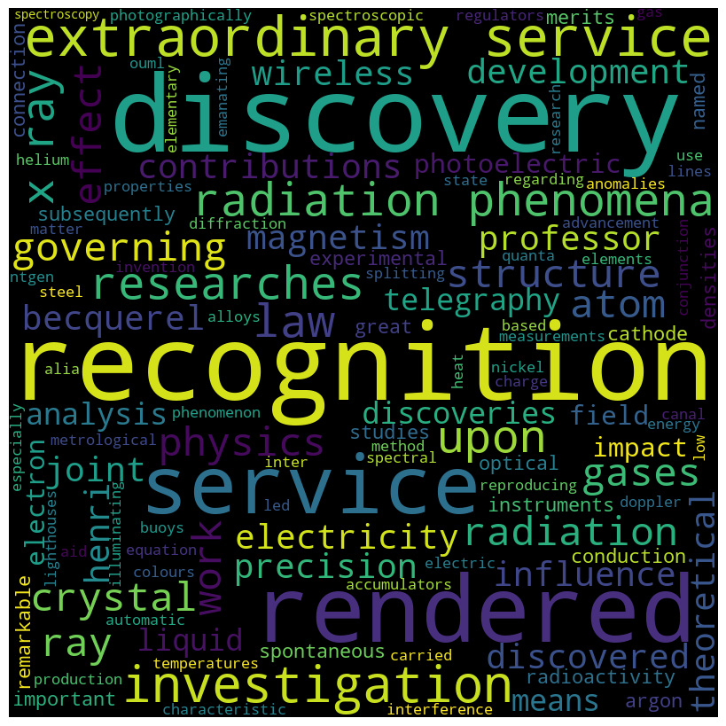

# REST API

The goal of this part of the assigment is to fetch data from the Nobel Prize REST API.

Fetch data in JSON format with information on the Nobel prizes in physics from the Nobel Prize API (v2). The docs can be found here.

API stands for application programmig interface and its a set of rules that helps us interact between different software
applications. The data **Nobel prizes** are stored on a server and api provides a way to intereact with that data. We will get 
that data over the internet. The way ot works is that we will make a request to datas endpoint (URL) and , the server will later process our request and provide us with relevant information. This way we can work with the data without locally having a copy on our pc.


```python
import requests
import json

```


```python
end_point = "http://api.nobelprize.org/2.0/nobelPrizes?yearTo=2023&nobelPrizeCategory=phy&format=json" 
response = requests.get(end_point)
data = response.json()
```


```python
data
```


    {'nobelPrizes': [{'awardYear': '1901',
       'category': {'en': 'Physics', 'no': 'Fysikk', 'se': 'Fysik'},
       'categoryFullName': {'en': 'The Nobel Prize in Physics',
        'no': 'Nobelprisen i fysikk',
        'se': 'Nobelpriset i fysik'},
       'dateAwarded': '1901-11-12',
       'prizeAmount': 150782,
       'prizeAmountAdjusted': 9704878,
       'links': {'rel': 'nobelPrize',
        'href': 'https://api.nobelprize.org/2/nobelPrize/phy/1901',
        'action': 'Get',
        'types': 'application/json'},
       'laureates': [{'id': '1',
         'knownName': {'en': 'Wilhelm Conrad Röntgen'},
         'fullName': {'en': 'Wilhelm Conrad Röntgen'},
         'portion': '1',
         'sortOrder': '1',
         'motivation': {'en': 'in recognition of the extraordinary services he has rendered by the discovery of the remarkable rays subsequently named after him',
          'se': 'såsom ett erkännande av den utomordentliga förtjänst han inlagt genom upptäckten av de egendomliga strålar, som sedermera uppkallats efter honom'},
         'links': {'rel': 'laureate',
          'href': 'https://api.nobelprize.org/2/laureate/1',
          'action': 'Get',
          'types': 'application/json'}}]},
      {'awardYear': '1902',
       'category': {'en': 'Physics', 'no': 'Fysikk', 'se': 'Fysik'},
       'categoryFullName': {'en': 'The Nobel Prize in Physics',
        'no': 'Nobelprisen i fysikk',
        'se': 'Nobelpriset i fysik'},
       'dateAwarded': '1902-11-11',
       'prizeAmount': 141847,
       'prizeAmountAdjusted': 9129789,
       'links': {'rel': 'nobelPrize',
        'href': 'https://api.nobelprize.org/2/nobelPrize/phy/1902',
        'action': 'Get',
        'types': 'application/json'},
       'laureates': [{'id': '2',
         'knownName': {'en': 'Hendrik A. Lorentz'},
         'fullName': {'en': 'Hendrik Antoon Lorentz'},
         'portion': '1/2',
         'sortOrder': '1',
         'motivation': {'en': 'in recognition of the extraordinary service they rendered by their researches into the influence of magnetism upon radiation phenomena',
          'se': 'såsom ett erkännande av den utomordentliga förtjänst de inlagt genom sina undersökningar över magnetismens inflytande på strålningsfenomenen'},
         'links': {'rel': 'laureate',
          'href': 'https://api.nobelprize.org/2/laureate/2',
          'action': 'Get',
          'types': 'application/json'}},
        {'id': '3',
         'knownName': {'en': 'Pieter Zeeman'},
         'fullName': {'en': 'Pieter Zeeman'},
         'portion': '1/2',
         'sortOrder': '2',
         'motivation': {'en': 'in recognition of the extraordinary service they rendered by their researches into the influence of magnetism upon radiation phenomena',
          'se': 'såsom ett erkännande av den utomordentliga förtjänst de inlagt genom sina undersökningar över magnetismens inflytande på strålningsfenomenen'},
         'links': {'rel': 'laureate',
          'href': 'https://api.nobelprize.org/2/laureate/3',
          'action': 'Get',
          'types': 'application/json'}}]},
      {'awardYear': '1903',
       'category': {'en': 'Physics', 'no': 'Fysikk', 'se': 'Fysik'},
       'categoryFullName': {'en': 'The Nobel Prize in Physics',
        'no': 'Nobelprisen i fysikk',
        'se': 'Nobelpriset i fysik'},
       'dateAwarded': '1903-11-12',
       'prizeAmount': 141358,
       'prizeAmountAdjusted': 8830717,
       'links': {'rel': 'nobelPrize',
        'href': 'https://api.nobelprize.org/2/nobelPrize/phy/1903',
        'action': 'Get',
        'types': 'application/json'},
       'laureates': [{'id': '4',
         'knownName': {'en': 'Henri Becquerel'},
         'fullName': {'en': 'Antoine Henri Becquerel'},
         'portion': '1/2',
         'sortOrder': '1',
         'motivation': {'en': 'in recognition of the extraordinary services he has rendered by his discovery of spontaneous radioactivity',
          'se': 'såsom ett erkännande av den utomordentliga förtjänst han inlagt genom upptäckten av den spontana radioaktiviteten'},
         'links': {'rel': 'laureate',
          'href': 'https://api.nobelprize.org/2/laureate/4',
          'action': 'Get',
          'types': 'application/json'}},
        {'id': '5',
         'knownName': {'en': 'Pierre Curie'},
         'fullName': {'en': 'Pierre Curie'},
         'portion': '1/4',
         'sortOrder': '2',
         'motivation': {'en': 'in recognition of the extraordinary services they have rendered by their joint researches on the radiation phenomena discovered by Professor Henri Becquerel',
          'se': 'såsom ett erkännande av den utomordentliga förtjänst de inlagt genom sina gemensamt utförda arbeten rörande de av Professor Henri Becquerel upptäckta strålningsfenomenen'},
         'links': {'rel': 'laureate',
          'href': 'https://api.nobelprize.org/2/laureate/5',
          'action': 'Get',
          'types': 'application/json'}},
        {'id': '6',
         'knownName': {'en': 'Marie Curie'},
         'fullName': {'en': 'Marie Curie, née Sklodowska'},
         'portion': '1/4',
         'sortOrder': '3',
         'motivation': {'en': 'in recognition of the extraordinary services they have rendered by their joint researches on the radiation phenomena discovered by Professor Henri Becquerel',
          'se': 'såsom ett erkännande av den utomordentliga förtjänst de inlagt genom sina gemensamt utförda arbeten rörande de av Professor Henri Becquerel upptäckta strålningsfenomenen'},
         'links': {'rel': 'laureate',
          'href': 'https://api.nobelprize.org/2/laureate/6',
          'action': 'Get',
          'types': 'application/json'}}]},
      {'awardYear': '1904',
       'category': {'en': 'Physics', 'no': 'Fysikk', 'se': 'Fysik'},
       'categoryFullName': {'en': 'The Nobel Prize in Physics',
        'no': 'Nobelprisen i fysikk',
        'se': 'Nobelpriset i fysik'},
       'dateAwarded': '1904-11-08',
       'prizeAmount': 140859,
       'prizeAmountAdjusted': 8799545,
       'links': {'rel': 'nobelPrize',
        'href': 'https://api.nobelprize.org/2/nobelPrize/phy/1904',
        'action': 'Get',
        'types': 'application/json'},
       'laureates': [{'id': '8',
         'knownName': {'en': 'Lord Rayleigh'},
         'fullName': {'en': 'Lord Rayleigh (John William Strutt)'},
         'portion': '1',
         'sortOrder': '1',
         'motivation': {'en': 'for his investigations of the densities of the most important gases and for his discovery of argon in connection with these studies',
          'se': 'för hans undersökningar rörande de viktigaste gasernas täthet samt hans i sammanhang med dessa undersökningar gjorda upptäckt av argon'},
         'links': {'rel': 'laureate',
          'href': 'https://api.nobelprize.org/2/laureate/8',
          'action': 'Get',
          'types': 'application/json'}}]},
      {'awardYear': '1905',
       'category': {'en': 'Physics', 'no': 'Fysikk', 'se': 'Fysik'},
       'categoryFullName': {'en': 'The Nobel Prize in Physics',
        'no': 'Nobelprisen i fysikk',
        'se': 'Nobelpriset i fysik'},
       'prizeAmount': 138089,
       'prizeAmountAdjusted': 8626501,
       'links': {'rel': 'nobelPrize',
        'href': 'https://api.nobelprize.org/2/nobelPrize/phy/1905',
        'action': 'Get',
        'types': 'application/json'},
       'laureates': [{'id': '9',
         'knownName': {'en': 'Philipp Lenard'},
         'fullName': {'en': 'Philipp Eduard Anton von Lenard'},
         'portion': '1',
         'sortOrder': '1',
         'motivation': {'en': 'for his work on cathode rays',
          'se': 'för hans arbeten över katodstrålarna'},
         'links': {'rel': 'laureate',
          'href': 'https://api.nobelprize.org/2/laureate/9',
          'action': 'Get',
          'types': 'application/json'}}]},
      {'awardYear': '1906',
       'category': {'en': 'Physics', 'no': 'Fysikk', 'se': 'Fysik'},
       'categoryFullName': {'en': 'The Nobel Prize in Physics',
        'no': 'Nobelprisen i fysikk',
        'se': 'Nobelpriset i fysik'},
       'dateAwarded': '1906-11-12',
       'prizeAmount': 138536,
       'prizeAmountAdjusted': 8407156,
       'links': {'rel': 'nobelPrize',
        'href': 'https://api.nobelprize.org/2/nobelPrize/phy/1906',
        'action': 'Get',
        'types': 'application/json'},
       'laureates': [{'id': '10',
         'knownName': {'en': 'J.J. Thomson'},
         'fullName': {'en': 'Joseph John Thomson'},
         'portion': '1',
         'sortOrder': '1',
         'motivation': {'en': 'in recognition of the great merits of his theoretical and experimental investigations on the conduction of electricity by gases',
          'se': 'såsom ett erkännande av den stora förtjänst han inlagt genom sina teoretiska och experimentella undersökningar över elektricitetens gång genom gaser'},
         'links': {'rel': 'laureate',
          'href': 'https://api.nobelprize.org/2/laureate/10',
          'action': 'Get',
          'types': 'application/json'}}]},
      {'awardYear': '1907',
       'category': {'en': 'Physics', 'no': 'Fysikk', 'se': 'Fysik'},
       'categoryFullName': {'en': 'The Nobel Prize in Physics',
        'no': 'Nobelprisen i fysikk',
        'se': 'Nobelpriset i fysik'},
       'dateAwarded': '1907-11-12',
       'prizeAmount': 138796,
       'prizeAmountAdjusted': 7967641,
       'links': {'rel': 'nobelPrize',
        'href': 'https://api.nobelprize.org/2/nobelPrize/phy/1907',
        'action': 'Get',
        'types': 'application/json'},
       'laureates': [{'id': '11',
         'knownName': {'en': 'Albert A. Michelson'},
         'fullName': {'en': 'Albert Abraham Michelson'},
         'portion': '1',
         'sortOrder': '1',
         'motivation': {'en': 'for his optical precision instruments and the spectroscopic and metrological investigations carried out with their aid',
          'se': 'för hans optiska precisionsinstrument och hans därmed utförda spektroskopiska och metrologiska undersökningar'},
         'links': {'rel': 'laureate',
          'href': 'https://api.nobelprize.org/2/laureate/11',
          'action': 'Get',
          'types': 'application/json'}}]},
      {'awardYear': '1908',
       'category': {'en': 'Physics', 'no': 'Fysikk', 'se': 'Fysik'},
       'categoryFullName': {'en': 'The Nobel Prize in Physics',
        'no': 'Nobelprisen i fysikk',
        'se': 'Nobelpriset i fysik'},
       'dateAwarded': '1908-11-10',
       'prizeAmount': 139800,
       'prizeAmountAdjusted': 8025276,
       'links': {'rel': 'nobelPrize',
        'href': 'https://api.nobelprize.org/2/nobelPrize/phy/1908',
        'action': 'Get',
        'types': 'application/json'},
       'laureates': [{'id': '12',
         'knownName': {'en': 'Gabriel Lippmann'},
         'fullName': {'en': 'Gabriel Lippmann'},
         'portion': '1',
         'sortOrder': '1',
         'motivation': {'en': 'for his method of reproducing colours photographically based on the phenomenon of interference',
          'se': 'för hans på interferensfenomenet grundade metod att fotografiskt återgiva färger'},
         'links': {'rel': 'laureate',
          'href': 'https://api.nobelprize.org/2/laureate/12',
          'action': 'Get',
          'types': 'application/json'}}]},
      {'awardYear': '1909',
       'category': {'en': 'Physics', 'no': 'Fysikk', 'se': 'Fysik'},
       'categoryFullName': {'en': 'The Nobel Prize in Physics',
        'no': 'Nobelprisen i fysikk',
        'se': 'Nobelpriset i fysik'},
       'dateAwarded': '1909-11-09',
       'prizeAmount': 139800,
       'prizeAmountAdjusted': 8025276,
       'links': {'rel': 'nobelPrize',
        'href': 'https://api.nobelprize.org/2/nobelPrize/phy/1909',
        'action': 'Get',
        'types': 'application/json'},
       'laureates': [{'id': '13',
         'knownName': {'en': 'Guglielmo Marconi'},
         'fullName': {'en': 'Guglielmo Marconi'},
         'portion': '1/2',
         'sortOrder': '1',
         'motivation': {'en': 'in recognition of their contributions to the development of wireless telegraphy',
          'se': 'såsom ett erkännande av deras förtjänster om den trådlösa telegrafiens utveckling'},
         'links': {'rel': 'laureate',
          'href': 'https://api.nobelprize.org/2/laureate/13',
          'action': 'Get',
          'types': 'application/json'}},
        {'id': '14',
         'knownName': {'en': 'Ferdinand Braun'},
         'fullName': {'en': 'Karl Ferdinand Braun'},
         'portion': '1/2',
         'sortOrder': '2',
         'motivation': {'en': 'in recognition of their contributions to the development of wireless telegraphy',
          'se': 'såsom ett erkännande av deras förtjänster om den trådlösa telegrafiens utveckling'},
         'links': {'rel': 'laureate',
          'href': 'https://api.nobelprize.org/2/laureate/14',
          'action': 'Get',
          'types': 'application/json'}}]},
      {'awardYear': '1910',
       'category': {'en': 'Physics', 'no': 'Fysikk', 'se': 'Fysik'},
       'categoryFullName': {'en': 'The Nobel Prize in Physics',
        'no': 'Nobelprisen i fysikk',
        'se': 'Nobelpriset i fysik'},
       'dateAwarded': '1910-11-05',
       'prizeAmount': 140703,
       'prizeAmountAdjusted': 8077113,
       'links': {'rel': 'nobelPrize',
        'href': 'https://api.nobelprize.org/2/nobelPrize/phy/1910',
        'action': 'Get',
        'types': 'application/json'},
       'laureates': [{'id': '15',
         'knownName': {'en': 'Johannes Diderik van der Waals'},
         'fullName': {'en': 'Johannes Diderik van der Waals'},
         'portion': '1',
         'sortOrder': '1',
         'motivation': {'en': 'for his work on the equation of state for gases and liquids',
          'se': 'för hans arbeten angående gasers och vätskors tillståndsekvation'},
         'links': {'rel': 'laureate',
          'href': 'https://api.nobelprize.org/2/laureate/15',
          'action': 'Get',
          'types': 'application/json'}}]},
      {'awardYear': '1911',
       'category': {'en': 'Physics', 'no': 'Fysikk', 'se': 'Fysik'},
       'categoryFullName': {'en': 'The Nobel Prize in Physics',
        'no': 'Nobelprisen i fysikk',
        'se': 'Nobelpriset i fysik'},
       'dateAwarded': '1911-11-07',
       'prizeAmount': 140695,
       'prizeAmountAdjusted': 8301005,
       'links': {'rel': 'nobelPrize',
        'href': 'https://api.nobelprize.org/2/nobelPrize/phy/1911',
        'action': 'Get',
        'types': 'application/json'},
       'laureates': [{'id': '16',
         'knownName': {'en': 'Wilhelm Wien'},
         'fullName': {'en': 'Wilhelm Wien'},
         'portion': '1',
         'sortOrder': '1',
         'motivation': {'en': 'for his discoveries regarding the laws governing the radiation of heat',
          'se': 'för hans upptäckter angående värmestrålningens lagar'},
         'links': {'rel': 'laureate',
          'href': 'https://api.nobelprize.org/2/laureate/16',
          'action': 'Get',
          'types': 'application/json'}}]},
      {'awardYear': '1912',
       'category': {'en': 'Physics', 'no': 'Fysikk', 'se': 'Fysik'},
       'categoryFullName': {'en': 'The Nobel Prize in Physics',
        'no': 'Nobelprisen i fysikk',
        'se': 'Nobelpriset i fysik'},
       'dateAwarded': '1912-11-12',
       'prizeAmount': 140476,
       'prizeAmountAdjusted': 7650539,
       'links': {'rel': 'nobelPrize',
        'href': 'https://api.nobelprize.org/2/nobelPrize/phy/1912',
        'action': 'Get',
        'types': 'application/json'},
       'laureates': [{'id': '17',
         'knownName': {'en': 'Gustaf Dalén'},
         'fullName': {'en': 'Nils Gustaf Dalén'},
         'portion': '1',
         'sortOrder': '1',
         'motivation': {'en': 'for his invention of automatic regulators for use in conjunction with gas accumulators for illuminating lighthouses and buoys',
          'se': 'för hans uppfinningar av självverkande regulatorer att i kombination med gasaccumulatorer användas till belysning av fyrar och lysbojar'},
         'links': {'rel': 'laureate',
          'href': 'https://api.nobelprize.org/2/laureate/17',
          'action': 'Get',
          'types': 'application/json'}}]},
      {'awardYear': '1913',
       'category': {'en': 'Physics', 'no': 'Fysikk', 'se': 'Fysik'},
       'categoryFullName': {'en': 'The Nobel Prize in Physics',
        'no': 'Nobelprisen i fysikk',
        'se': 'Nobelpriset i fysik'},
       'dateAwarded': '1913-11-11',
       'prizeAmount': 143010,
       'prizeAmountAdjusted': 7788545,
       'links': {'rel': 'nobelPrize',
        'href': 'https://api.nobelprize.org/2/nobelPrize/phy/1913',
        'action': 'Get',
        'types': 'application/json'},
       'laureates': [{'id': '18',
         'knownName': {'en': 'Heike Kamerlingh Onnes'},
         'fullName': {'en': 'Heike Kamerlingh Onnes'},
         'portion': '1',
         'sortOrder': '1',
         'motivation': {'en': 'for his investigations on the properties of matter at low temperatures which led, inter alia, to the production of liquid helium',
          'se': 'i anledning av hans undersökningar över kroppars egenskaper vid låga temperaturer, vilka bland annat lett till framställningen av flytande helium'},
         'links': {'rel': 'laureate',
          'href': 'https://api.nobelprize.org/2/laureate/18',
          'action': 'Get',
          'types': 'application/json'}}]},
      {'awardYear': '1914',
       'category': {'en': 'Physics', 'no': 'Fysikk', 'se': 'Fysik'},
       'categoryFullName': {'en': 'The Nobel Prize in Physics',
        'no': 'Nobelprisen i fysikk',
        'se': 'Nobelpriset i fysik'},
       'dateAwarded': '1915-11-11',
       'prizeAmount': 146900,
       'prizeAmountAdjusted': 8000400,
       'links': {'rel': 'nobelPrize',
        'href': 'https://api.nobelprize.org/2/nobelPrize/phy/1914',
        'action': 'Get',
        'types': 'application/json'},
       'laureates': [{'id': '19',
         'knownName': {'en': 'Max von Laue'},
         'fullName': {'en': 'Max von Laue'},
         'portion': '1',
         'sortOrder': '1',
         'motivation': {'en': 'for his discovery of the diffraction of X-rays by crystals',
          'se': 'för hans upptäckt av röntgenstrålarnas diffraktion i kristaller'},
         'links': {'rel': 'laureate',
          'href': 'https://api.nobelprize.org/2/laureate/19',
          'action': 'Get',
          'types': 'application/json'}}]},
      {'awardYear': '1915',
       'category': {'en': 'Physics', 'no': 'Fysikk', 'se': 'Fysik'},
       'categoryFullName': {'en': 'The Nobel Prize in Physics',
        'no': 'Nobelprisen i fysikk',
        'se': 'Nobelpriset i fysik'},
       'dateAwarded': '1915-11-12',
       'prizeAmount': 149223,
       'prizeAmountAdjusted': 7043326,
       'links': {'rel': 'nobelPrize',
        'href': 'https://api.nobelprize.org/2/nobelPrize/phy/1915',
        'action': 'Get',
        'types': 'application/json'},
       'laureates': [{'id': '20',
         'knownName': {'en': 'William Bragg'},
         'fullName': {'en': 'Sir William Henry Bragg'},
         'portion': '1/2',
         'sortOrder': '1',
         'motivation': {'en': 'for their services in the analysis of crystal structure by means of X-rays',
          'se': 'för deras förtjänster om utforskandet av kristallstrukturer medelst röntgenstrålar'},
         'links': {'rel': 'laureate',
          'href': 'https://api.nobelprize.org/2/laureate/20',
          'action': 'Get',
          'types': 'application/json'}},
        {'id': '21',
         'knownName': {'en': 'Lawrence Bragg'},
         'fullName': {'en': 'William Lawrence Bragg'},
         'portion': '1/2',
         'sortOrder': '2',
         'motivation': {'en': 'for their services in the analysis of crystal structure by means of X-rays',
          'se': 'för deras förtjänster om utforskandet av kristallstrukturer medelst röntgenstrålar'},
         'links': {'rel': 'laureate',
          'href': 'https://api.nobelprize.org/2/laureate/21',
          'action': 'Get',
          'types': 'application/json'}}]},
      {'awardYear': '1916',
       'category': {'en': 'Physics', 'no': 'Fysikk', 'se': 'Fysik'},
       'categoryFullName': {'en': 'The Nobel Prize in Physics',
        'no': 'Nobelprisen i fysikk',
        'se': 'Nobelpriset i fysik'},
       'dateAwarded': '1916-10-01',
       'topMotivation': {'en': 'No Nobel Prize was awarded this year. The prize money was allocated to the Special Fund of this prize section.'},
       'prizeAmount': 131793,
       'prizeAmountAdjusted': 5488791,
       'links': {'rel': 'nobelPrize',
        'href': 'https://api.nobelprize.org/2/nobelPrize/phy/1916',
        'action': 'Get',
        'types': 'application/json'}},
      {'awardYear': '1917',
       'category': {'en': 'Physics', 'no': 'Fysikk', 'se': 'Fysik'},
       'categoryFullName': {'en': 'The Nobel Prize in Physics',
        'no': 'Nobelprisen i fysikk',
        'se': 'Nobelpriset i fysik'},
       'dateAwarded': '1918-11-12',
       'prizeAmount': 133823,
       'prizeAmountAdjusted': 4441251,
       'links': {'rel': 'nobelPrize',
        'href': 'https://api.nobelprize.org/2/nobelPrize/phy/1917',
        'action': 'Get',
        'types': 'application/json'},
       'laureates': [{'id': '22',
         'knownName': {'en': 'Charles Glover Barkla'},
         'fullName': {'en': 'Charles Glover Barkla'},
         'portion': '1',
         'sortOrder': '1',
         'motivation': {'en': 'for his discovery of the characteristic R&ouml;ntgen radiation of the elements',
          'se': 'för hans upptäckt av den karakteristiska röntgenstrålningen hos elementen'},
         'links': {'rel': 'laureate',
          'href': 'https://api.nobelprize.org/2/laureate/22',
          'action': 'Get',
          'types': 'application/json'}}]},
      {'awardYear': '1918',
       'category': {'en': 'Physics', 'no': 'Fysikk', 'se': 'Fysik'},
       'categoryFullName': {'en': 'The Nobel Prize in Physics',
        'no': 'Nobelprisen i fysikk',
        'se': 'Nobelpriset i fysik'},
       'dateAwarded': '1919-11-13',
       'prizeAmount': 138198,
       'prizeAmountAdjusted': 3225632,
       'links': {'rel': 'nobelPrize',
        'href': 'https://api.nobelprize.org/2/nobelPrize/phy/1918',
        'action': 'Get',
        'types': 'application/json'},
       'laureates': [{'id': '23',
         'knownName': {'en': 'Max Planck'},
         'fullName': {'en': 'Max Karl Ernst Ludwig Planck'},
         'portion': '1',
         'sortOrder': '1',
         'motivation': {'en': 'in recognition of the services he rendered to the advancement of Physics by his discovery of energy quanta',
          'se': 'såsom ett erkännande av den förtjänst han genom upptäckten av elementarkvanta inlagt om fysikens utveckling'},
         'links': {'rel': 'laureate',
          'href': 'https://api.nobelprize.org/2/laureate/23',
          'action': 'Get',
          'types': 'application/json'}}]},
      {'awardYear': '1919',
       'category': {'en': 'Physics', 'no': 'Fysikk', 'se': 'Fysik'},
       'categoryFullName': {'en': 'The Nobel Prize in Physics',
        'no': 'Nobelprisen i fysikk',
        'se': 'Nobelpriset i fysik'},
       'dateAwarded': '1919-11-13',
       'prizeAmount': 133127,
       'prizeAmountAdjusted': 2692969,
       'links': {'rel': 'nobelPrize',
        'href': 'https://api.nobelprize.org/2/nobelPrize/phy/1919',
        'action': 'Get',
        'types': 'application/json'},
       'laureates': [{'id': '24',
         'knownName': {'en': 'Johannes Stark'},
         'fullName': {'en': 'Johannes Stark'},
         'portion': '1',
         'sortOrder': '1',
         'motivation': {'en': 'for his discovery of the Doppler effect in canal rays and the splitting of spectral lines in electric fields',
          'se': 'för hans upptäckt av dopplereffekten hos kanalstrålar och av spektrallinjers uppdelning i elektriska fält'},
         'links': {'rel': 'laureate',
          'href': 'https://api.nobelprize.org/2/laureate/24',
          'action': 'Get',
          'types': 'application/json'}}]},
      {'awardYear': '1920',
       'category': {'en': 'Physics', 'no': 'Fysikk', 'se': 'Fysik'},
       'categoryFullName': {'en': 'The Nobel Prize in Physics',
        'no': 'Nobelprisen i fysikk',
        'se': 'Nobelpriset i fysik'},
       'dateAwarded': '1920-11-11',
       'prizeAmount': 134100,
       'prizeAmountAdjusted': 2712651,
       'links': {'rel': 'nobelPrize',
        'href': 'https://api.nobelprize.org/2/nobelPrize/phy/1920',
        'action': 'Get',
        'types': 'application/json'},
       'laureates': [{'id': '25',
         'knownName': {'en': 'Charles Edouard Guillaume'},
         'fullName': {'en': 'Charles Edouard Guillaume'},
         'portion': '1',
         'sortOrder': '1',
         'motivation': {'en': 'in recognition of the service he has rendered to precision measurements in Physics by his discovery of anomalies in nickel steel alloys',
          'se': 'såsom ett erkännande av den förtjänst han genom upptäckten av nickelstållegeringarnas anomalier inlagt om precisionsfysiken'},
         'links': {'rel': 'laureate',
          'href': 'https://api.nobelprize.org/2/laureate/25',
          'action': 'Get',
          'types': 'application/json'}}]},
      {'awardYear': '1921',
       'category': {'en': 'Physics', 'no': 'Fysikk', 'se': 'Fysik'},
       'categoryFullName': {'en': 'The Nobel Prize in Physics',
        'no': 'Nobelprisen i fysikk',
        'se': 'Nobelpriset i fysik'},
       'dateAwarded': '1922-11-09',
       'prizeAmount': 121573,
       'prizeAmountAdjusted': 2869123,
       'links': {'rel': 'nobelPrize',
        'href': 'https://api.nobelprize.org/2/nobelPrize/phy/1921',
        'action': 'Get',
        'types': 'application/json'},
       'laureates': [{'id': '26',
         'knownName': {'en': 'Albert Einstein'},
         'fullName': {'en': 'Albert Einstein'},
         'portion': '1',
         'sortOrder': '1',
         'motivation': {'en': 'for his services to Theoretical Physics, and especially for his discovery of the law of the photoelectric effect',
          'se': 'för hans förtjänster om den teoretiska fysiken, särskilt hans upptäckt av lagen för den fotoelektriska effekten'},
         'links': {'rel': 'laureate',
          'href': 'https://api.nobelprize.org/2/laureate/26',
          'action': 'Get',
          'types': 'application/json'}}]},
      {'awardYear': '1922',
       'category': {'en': 'Physics', 'no': 'Fysikk', 'se': 'Fysik'},
       'categoryFullName': {'en': 'The Nobel Prize in Physics',
        'no': 'Nobelprisen i fysikk',
        'se': 'Nobelpriset i fysik'},
       'dateAwarded': '1922-11-09',
       'prizeAmount': 122483,
       'prizeAmountAdjusted': 3563752,
       'links': {'rel': 'nobelPrize',
        'href': 'https://api.nobelprize.org/2/nobelPrize/phy/1922',
        'action': 'Get',
        'types': 'application/json'},
       'laureates': [{'id': '27',
         'knownName': {'en': 'Niels Bohr'},
         'fullName': {'en': 'Niels Henrik David Bohr'},
         'portion': '1',
         'sortOrder': '1',
         'motivation': {'en': 'for his services in the investigation of the structure of atoms and of the radiation emanating from them',
          'se': 'för hans förtjänster om utforskandet av atomernas struktur och den från dem utgående strålningen'},
         'links': {'rel': 'laureate',
          'href': 'https://api.nobelprize.org/2/laureate/27',
          'action': 'Get',
          'types': 'application/json'}}]},
      {'awardYear': '1923',
       'category': {'en': 'Physics', 'no': 'Fysikk', 'se': 'Fysik'},
       'categoryFullName': {'en': 'The Nobel Prize in Physics',
        'no': 'Nobelprisen i fysikk',
        'se': 'Nobelpriset i fysik'},
       'dateAwarded': '1923-11-13',
       'prizeAmount': 114935,
       'prizeAmountAdjusted': 3590029,
       'links': {'rel': 'nobelPrize',
        'href': 'https://api.nobelprize.org/2/nobelPrize/phy/1923',
        'action': 'Get',
        'types': 'application/json'},
       'laureates': [{'id': '28',
         'knownName': {'en': 'Robert A. Millikan'},
         'fullName': {'en': 'Robert Andrews Millikan'},
         'portion': '1',
         'sortOrder': '1',
         'motivation': {'en': 'for his work on the elementary charge of electricity and on the photoelectric effect',
          'se': 'för hans arbeten rörande den elektriska enhetsladdningen samt den fotoelektriska effekten'},
         'links': {'rel': 'laureate',
          'href': 'https://api.nobelprize.org/2/laureate/28',
          'action': 'Get',
          'types': 'application/json'}}]},
      {'awardYear': '1924',
       'category': {'en': 'Physics', 'no': 'Fysikk', 'se': 'Fysik'},
       'categoryFullName': {'en': 'The Nobel Prize in Physics',
        'no': 'Nobelprisen i fysikk',
        'se': 'Nobelpriset i fysik'},
       'dateAwarded': '1925-11-12',
       'prizeAmount': 116719,
       'prizeAmountAdjusted': 3645752,
       'links': {'rel': 'nobelPrize',
        'href': 'https://api.nobelprize.org/2/nobelPrize/phy/1924',
        'action': 'Get',
        'types': 'application/json'},
       'laureates': [{'id': '29',
         'knownName': {'en': 'Manne Siegbahn'},
         'fullName': {'en': 'Karl Manne Georg Siegbahn'},
         'portion': '1',
         'sortOrder': '1',
         'motivation': {'en': 'for his discoveries and research in the field of X-ray spectroscopy',
          'se': 'för hans röntgenspektroskopiska upptäckter och forskningar'},
         'links': {'rel': 'laureate',
          'href': 'https://api.nobelprize.org/2/laureate/29',
          'action': 'Get',
          'types': 'application/json'}}]},
      {'awardYear': '1925',
       'category': {'en': 'Physics', 'no': 'Fysikk', 'se': 'Fysik'},
       'categoryFullName': {'en': 'The Nobel Prize in Physics',
        'no': 'Nobelprisen i fysikk',
        'se': 'Nobelpriset i fysik'},
       'dateAwarded': '1926-11-11',
       'prizeAmount': 118165,
       'prizeAmountAdjusted': 3637427,
       'links': {'rel': 'nobelPrize',
        'href': 'https://api.nobelprize.org/2/nobelPrize/phy/1925',
        'action': 'Get',
        'types': 'application/json'},
       'laureates': [{'id': '30',
         'knownName': {'en': 'James Franck'},
         'fullName': {'en': 'James Franck'},
         'portion': '1/2',
         'sortOrder': '1',
         'motivation': {'en': 'for their discovery of the laws governing the impact of an electron upon an atom',
          'se': 'med anledning av deras upptäckt av lagarna för stöten mellan en elektron och en atom'},
         'links': {'rel': 'laureate',
          'href': 'https://api.nobelprize.org/2/laureate/30',
          'action': 'Get',
          'types': 'application/json'}},
        {'id': '31',
         'knownName': {'en': 'Gustav Hertz'},
         'fullName': {'en': 'Gustav Ludwig Hertz'},
         'portion': '1/2',
         'sortOrder': '2',
         'motivation': {'en': 'for their discovery of the laws governing the impact of an electron upon an atom',
          'se': 'med anledning av deras upptäckt av lagarna för stöten mellan en elektron och en atom'},
         'links': {'rel': 'laureate',
          'href': 'https://api.nobelprize.org/2/laureate/31',
          'action': 'Get',
          'types': 'application/json'}}]}],
     'meta': {'offset': 0,
      'limit': 25,
      'nobelPrizeCategory': 'phy',
      'count': 123,
      'terms': 'https://www.nobelprize.org/about/terms-of-use-for-api-nobelprize-org-and-data-nobelprize-org/',
      'license': 'https://www.nobelprize.org/about/terms-of-use-for-api-nobelprize-org-and-data-nobelprize-org/#licence',
      'disclaimer': 'https://www.nobelprize.org/about/terms-of-use-for-api-nobelprize-org-and-data-nobelprize-org/#disclaimer'},
     'links': {'first': 'https://masterdataapi.nobelprize.org/2.0/nobelPrizes?offset=0&limit=25&nobelPrizeCategory=phy',
      'self': 'https://masterdataapi.nobelprize.org/2.0/nobelPrizes?offset=0&limit=25&nobelPrizeCategory=phy',
      'next': 'https://masterdataapi.nobelprize.org/2.0/nobelPrizes?offset=25&limit=25&nobelPrizeCategory=phy',
      'last': 'https://masterdataapi.nobelprize.org/2.0/nobelPrizes?offset=100&limit=25&nobelPrizeCategory=phy'}}


#### Using the retrieved data, extract all the prize motivations from the JSON-list and visualise the frequencies using a word cloud. 

The algoritm (briefly) is following: 
First we will create an empty string where we will append all the words from the different motivation keys. We will also create a set of **stopwords** with the imported library. The stopwords are words that have very little meaning for our analysis and hence words that we wish to ignore. Words like "the" "an" "and" are included in that list.

We will then create a loop that iterates the data. From the data we will get **nobelPrizes** and from there we will get **laureates** and from there to **motivation** key. In that way we will "snatch" all motivations strings. 

After that we will split our motivation string into individual words and make every word with a lower case.
Since we got different languages in the data we will also specify that we want to extract the english type of motivation string. after that these words will join the empty string that we initially created. 

When this is done we will generate a **Word cloud** which is a package. The word cloud have different paramters like size, background color etc. We can adjust them pretty much however we like. One of the important parameteres is **stop words** so that we can exclude unnessecary words.

We will then visualize (plot) the frequency of the data. The size of the words in the image corresponds to the frequency of that word in the data.


```python
from wordcloud import WordCloud, STOPWORDS
import matplotlib.pyplot as plt
import pandas as pd
```


```python
comment_words = ''  #creating an empty string
stopwords = set(STOPWORDS) #define stop words - prebuild

for prize in data.get('nobelPrizes', []):  #creating a foor loop and iterationg for nobelPrizes
    laureates = prize.get('laureates', []) # contonue iterationg for laureates

    # Iterate through the laureates
    for laureate in laureates:
        motivation_dict = laureate.get('motivation', {})  # get the motivation string

        motivation = motivation_dict.get('en', '') # getting the "eng version" of the motivation string

        
        tokens = motivation.split() #split into words (tokens)

        for i in range(len(tokens)):
            tokens[i] = tokens[i].lower()  # convert all tokens to lowercase

        comment_words += " ".join(tokens) + " "  #appends words to the empty string that we created

wordcloud = WordCloud(width=800, height=800,  #creating a wordcloud with all the parameters
background_color='black',
stopwords=stopwords,
min_font_size=10).generate(comment_words)

plt.figure(figsize=(8, 8), facecolor=None) # plotting
plt.imshow(wordcloud)
plt.axis("off")
plt.tight_layout(pad=0)

plt.show()
```


    

    


# Web Scraping


The goal of this part of the assignment is to scrape data from https://books.toscrape.com/.
Create a web scraper that generates the following table. You can find more information on each book on its own webpage.

In many cases the data that we eventually wish to work with are not always in the API format. To come aroud that we can use **web scraping**. Web scraping involves methods for retrviing data from websites. We will use **BeatifulSoup** library which is 
a HTML parsing library.

Now we have to tell to BeatifulSoup what to scrape. For that we will inspect the HTML of the webpage.
For instance from the webpage in this task we can see that each book lies inside of **< article >** tag. And this tag has class atributes **product_pod**. 

So what we will do first is that we are going to look for the elements "article" that has class "product_pod".
We will then iterate over each such element and extract our data. We wish to extract the title, price and rating
adn then append **all_data** with the relevant data (3 elemets for each iteration) When we have done that we wish to represent it as a dataframe.s

Note that all this needs be done for the first 3 pages of our website. We will therefore iterate once again for pages 1-3.


```python
import pandas as pd
import requests 
from bs4 import BeautifulSoup 
```


```python
url_books = "https://books.toscrape.com/" #url for the website

all_data = []  # we will store the data here

for page_number in range(1, 4): #loop for page 1-3
    page_url = url_books.format(page_number) #construct url for page 1,2,3
    r = requests.get(page_url) #store the get request in variable r
    soup = BeautifulSoup(r.content, 'html.parser') # creates a "soup" object
    book_containers = soup.find_all('article', class_='product_pod') # find element article with class product_pod

    for book in book_containers:  #loop for iterating for each article (book)
        title = book.h3.a['title'] #getting title
        price = book.select_one('div p.price_color').get_text() #getting price
        rating = book.select_one('p.star-rating')['class'][1] # getting raing
        all_data.append((title, price, rating)) # appends data with triplet (title, price , rating)

df = pd.DataFrame(all_data, columns=['Title', 'Price', 'Rating']) #creating a dataframe with correct columns

df
```


<div>
<style scoped>
    .dataframe tbody tr th:only-of-type {
        vertical-align: middle;
    }

    .dataframe tbody tr th {
        vertical-align: top;
    }

    .dataframe thead th {
        text-align: right;
    }
</style>
<table border="1" class="dataframe">
  <thead>
    <tr style="text-align: right;">
      <th></th>
      <th>Title</th>
      <th>Price</th>
      <th>Rating</th>
    </tr>
  </thead>
  <tbody>
    <tr>
      <th>0</th>
      <td>A Light in the Attic</td>
      <td>£51.77</td>
      <td>Three</td>
    </tr>
    <tr>
      <th>1</th>
      <td>Tipping the Velvet</td>
      <td>£53.74</td>
      <td>One</td>
    </tr>
    <tr>
      <th>2</th>
      <td>Soumission</td>
      <td>£50.10</td>
      <td>One</td>
    </tr>
    <tr>
      <th>3</th>
      <td>Sharp Objects</td>
      <td>£47.82</td>
      <td>Four</td>
    </tr>
    <tr>
      <th>4</th>
      <td>Sapiens: A Brief History of Humankind</td>
      <td>£54.23</td>
      <td>Five</td>
    </tr>
    <tr>
      <th>5</th>
      <td>The Requiem Red</td>
      <td>£22.65</td>
      <td>One</td>
    </tr>
    <tr>
      <th>6</th>
      <td>The Dirty Little Secrets of Getting Your Dream...</td>
      <td>£33.34</td>
      <td>Four</td>
    </tr>
    <tr>
      <th>7</th>
      <td>The Coming Woman: A Novel Based on the Life of...</td>
      <td>£17.93</td>
      <td>Three</td>
    </tr>
    <tr>
      <th>8</th>
      <td>The Boys in the Boat: Nine Americans and Their...</td>
      <td>£22.60</td>
      <td>Four</td>
    </tr>
    <tr>
      <th>9</th>
      <td>The Black Maria</td>
      <td>£52.15</td>
      <td>One</td>
    </tr>
    <tr>
      <th>10</th>
      <td>Starving Hearts (Triangular Trade Trilogy, #1)</td>
      <td>£13.99</td>
      <td>Two</td>
    </tr>
    <tr>
      <th>11</th>
      <td>Shakespeare's Sonnets</td>
      <td>£20.66</td>
      <td>Four</td>
    </tr>
    <tr>
      <th>12</th>
      <td>Set Me Free</td>
      <td>£17.46</td>
      <td>Five</td>
    </tr>
    <tr>
      <th>13</th>
      <td>Scott Pilgrim's Precious Little Life (Scott Pi...</td>
      <td>£52.29</td>
      <td>Five</td>
    </tr>
    <tr>
      <th>14</th>
      <td>Rip it Up and Start Again</td>
      <td>£35.02</td>
      <td>Five</td>
    </tr>
    <tr>
      <th>15</th>
      <td>Our Band Could Be Your Life: Scenes from the A...</td>
      <td>£57.25</td>
      <td>Three</td>
    </tr>
    <tr>
      <th>16</th>
      <td>Olio</td>
      <td>£23.88</td>
      <td>One</td>
    </tr>
    <tr>
      <th>17</th>
      <td>Mesaerion: The Best Science Fiction Stories 18...</td>
      <td>£37.59</td>
      <td>One</td>
    </tr>
    <tr>
      <th>18</th>
      <td>Libertarianism for Beginners</td>
      <td>£51.33</td>
      <td>Two</td>
    </tr>
    <tr>
      <th>19</th>
      <td>It's Only the Himalayas</td>
      <td>£45.17</td>
      <td>Two</td>
    </tr>
    <tr>
      <th>20</th>
      <td>A Light in the Attic</td>
      <td>£51.77</td>
      <td>Three</td>
    </tr>
    <tr>
      <th>21</th>
      <td>Tipping the Velvet</td>
      <td>£53.74</td>
      <td>One</td>
    </tr>
    <tr>
      <th>22</th>
      <td>Soumission</td>
      <td>£50.10</td>
      <td>One</td>
    </tr>
    <tr>
      <th>23</th>
      <td>Sharp Objects</td>
      <td>£47.82</td>
      <td>Four</td>
    </tr>
    <tr>
      <th>24</th>
      <td>Sapiens: A Brief History of Humankind</td>
      <td>£54.23</td>
      <td>Five</td>
    </tr>
    <tr>
      <th>25</th>
      <td>The Requiem Red</td>
      <td>£22.65</td>
      <td>One</td>
    </tr>
    <tr>
      <th>26</th>
      <td>The Dirty Little Secrets of Getting Your Dream...</td>
      <td>£33.34</td>
      <td>Four</td>
    </tr>
    <tr>
      <th>27</th>
      <td>The Coming Woman: A Novel Based on the Life of...</td>
      <td>£17.93</td>
      <td>Three</td>
    </tr>
    <tr>
      <th>28</th>
      <td>The Boys in the Boat: Nine Americans and Their...</td>
      <td>£22.60</td>
      <td>Four</td>
    </tr>
    <tr>
      <th>29</th>
      <td>The Black Maria</td>
      <td>£52.15</td>
      <td>One</td>
    </tr>
    <tr>
      <th>30</th>
      <td>Starving Hearts (Triangular Trade Trilogy, #1)</td>
      <td>£13.99</td>
      <td>Two</td>
    </tr>
    <tr>
      <th>31</th>
      <td>Shakespeare's Sonnets</td>
      <td>£20.66</td>
      <td>Four</td>
    </tr>
    <tr>
      <th>32</th>
      <td>Set Me Free</td>
      <td>£17.46</td>
      <td>Five</td>
    </tr>
    <tr>
      <th>33</th>
      <td>Scott Pilgrim's Precious Little Life (Scott Pi...</td>
      <td>£52.29</td>
      <td>Five</td>
    </tr>
    <tr>
      <th>34</th>
      <td>Rip it Up and Start Again</td>
      <td>£35.02</td>
      <td>Five</td>
    </tr>
    <tr>
      <th>35</th>
      <td>Our Band Could Be Your Life: Scenes from the A...</td>
      <td>£57.25</td>
      <td>Three</td>
    </tr>
    <tr>
      <th>36</th>
      <td>Olio</td>
      <td>£23.88</td>
      <td>One</td>
    </tr>
    <tr>
      <th>37</th>
      <td>Mesaerion: The Best Science Fiction Stories 18...</td>
      <td>£37.59</td>
      <td>One</td>
    </tr>
    <tr>
      <th>38</th>
      <td>Libertarianism for Beginners</td>
      <td>£51.33</td>
      <td>Two</td>
    </tr>
    <tr>
      <th>39</th>
      <td>It's Only the Himalayas</td>
      <td>£45.17</td>
      <td>Two</td>
    </tr>
    <tr>
      <th>40</th>
      <td>A Light in the Attic</td>
      <td>£51.77</td>
      <td>Three</td>
    </tr>
    <tr>
      <th>41</th>
      <td>Tipping the Velvet</td>
      <td>£53.74</td>
      <td>One</td>
    </tr>
    <tr>
      <th>42</th>
      <td>Soumission</td>
      <td>£50.10</td>
      <td>One</td>
    </tr>
    <tr>
      <th>43</th>
      <td>Sharp Objects</td>
      <td>£47.82</td>
      <td>Four</td>
    </tr>
    <tr>
      <th>44</th>
      <td>Sapiens: A Brief History of Humankind</td>
      <td>£54.23</td>
      <td>Five</td>
    </tr>
    <tr>
      <th>45</th>
      <td>The Requiem Red</td>
      <td>£22.65</td>
      <td>One</td>
    </tr>
    <tr>
      <th>46</th>
      <td>The Dirty Little Secrets of Getting Your Dream...</td>
      <td>£33.34</td>
      <td>Four</td>
    </tr>
    <tr>
      <th>47</th>
      <td>The Coming Woman: A Novel Based on the Life of...</td>
      <td>£17.93</td>
      <td>Three</td>
    </tr>
    <tr>
      <th>48</th>
      <td>The Boys in the Boat: Nine Americans and Their...</td>
      <td>£22.60</td>
      <td>Four</td>
    </tr>
    <tr>
      <th>49</th>
      <td>The Black Maria</td>
      <td>£52.15</td>
      <td>One</td>
    </tr>
    <tr>
      <th>50</th>
      <td>Starving Hearts (Triangular Trade Trilogy, #1)</td>
      <td>£13.99</td>
      <td>Two</td>
    </tr>
    <tr>
      <th>51</th>
      <td>Shakespeare's Sonnets</td>
      <td>£20.66</td>
      <td>Four</td>
    </tr>
    <tr>
      <th>52</th>
      <td>Set Me Free</td>
      <td>£17.46</td>
      <td>Five</td>
    </tr>
    <tr>
      <th>53</th>
      <td>Scott Pilgrim's Precious Little Life (Scott Pi...</td>
      <td>£52.29</td>
      <td>Five</td>
    </tr>
    <tr>
      <th>54</th>
      <td>Rip it Up and Start Again</td>
      <td>£35.02</td>
      <td>Five</td>
    </tr>
    <tr>
      <th>55</th>
      <td>Our Band Could Be Your Life: Scenes from the A...</td>
      <td>£57.25</td>
      <td>Three</td>
    </tr>
    <tr>
      <th>56</th>
      <td>Olio</td>
      <td>£23.88</td>
      <td>One</td>
    </tr>
    <tr>
      <th>57</th>
      <td>Mesaerion: The Best Science Fiction Stories 18...</td>
      <td>£37.59</td>
      <td>One</td>
    </tr>
    <tr>
      <th>58</th>
      <td>Libertarianism for Beginners</td>
      <td>£51.33</td>
      <td>Two</td>
    </tr>
    <tr>
      <th>59</th>
      <td>It's Only the Himalayas</td>
      <td>£45.17</td>
      <td>Two</td>
    </tr>
  </tbody>
</table>
</div>


```python
!jupyter nbconvert --to markdown hw6.ipynb
```

    [NbConvertApp] Converting notebook hw6.ipynb to markdown
    [NbConvertApp] Support files will be in hw6_files\
    [NbConvertApp] Making directory hw6_files
    [NbConvertApp] Writing 46596 bytes to hw6.md
    


```python

```
